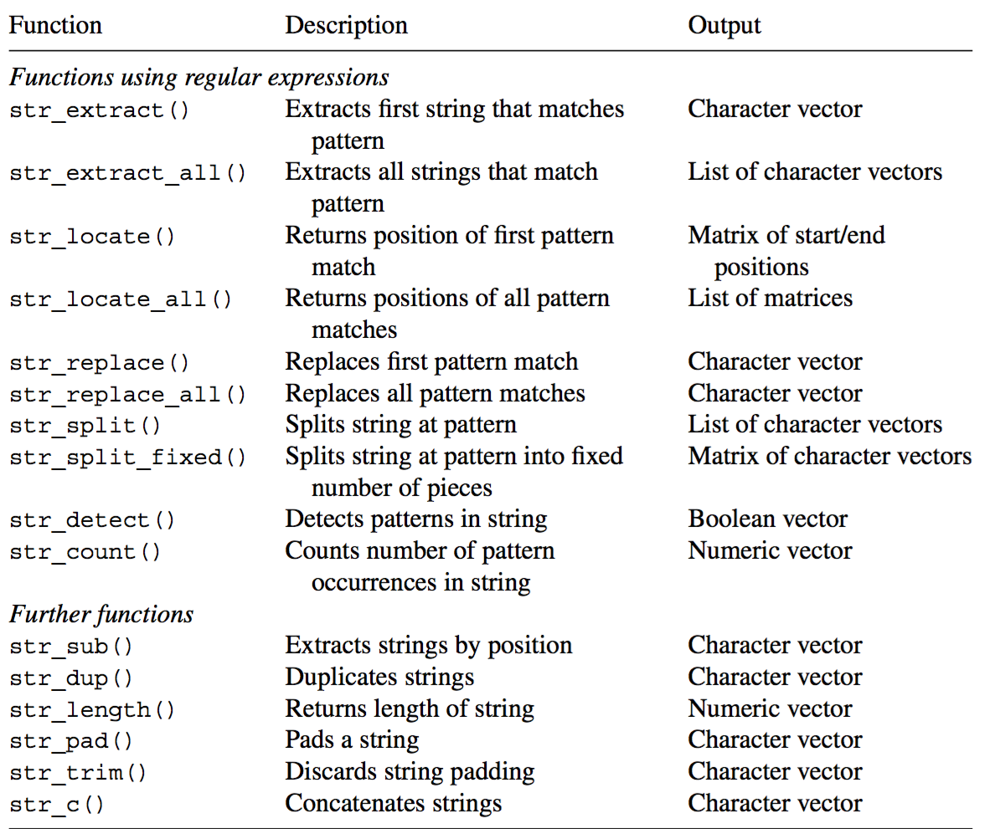
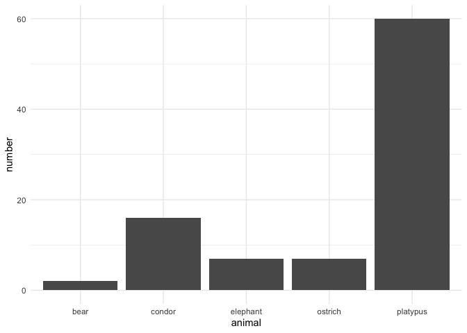

QTA Day 2: String operations and inspecting a corpus
================

## String operations

`R` stores text as a `string` or `character` vector. It is important to
become comfortable with string operations, since they allow you to clean
a string before you start analyzing your text.

These string operations require familiarity with regular expressions in
`R` as well as with functions in the **stringr** library.[^1]

Libraries like **quanteda** include some string cleaning functions as
well but knowledge of regular expressions and string operations allow
you to deal with the particulars of your text. That being said, these
operations usually involve lots of trial and error as well as using
Google to figure out how to do certain things. But they help you clean
your data, which will save you lot of headaches later on. Let’s take a
look at a set of useful functions.

First load the `stringr` library in `R`.

``` r
library(stringr)
```

Then create a string vector called shopping_list:

``` r
shopping_list <- c("apples x45!", "loaf of bread", "Bag of sugar", "milk x2 or x3")
```

Vectors are basic objects in `R` which contain a set of values of the
same type (character, numeric, factor, etc.) The shopping_list contains
four character strings Check that this is true with the `str()`
function:

``` r
str(shopping_list)
```

    ##  chr [1:4] "apples x45!" "loaf of bread" "Bag of sugar" "milk x2 or x3"

The `stringr` library contains many useful functions for working with
character values, which are listed in this [cheat
sheet](https://github.com/rstudio/cheatsheets/blob/master/strings.pdf).
Let’s go through a few examples, starting with the `str_extract ()`
function, which takes in two arguments: a string and a pattern to look
for. For each string it returns the pattern it found. Let’s see if it
finds a B in each of the strings:

``` r
str_extract(shopping_list, "B")
```

    ## [1] NA  NA  "B" NA

Functions in the `stringr` library can work with regular expressions.
For example, execute the following line of code:

``` r
str_extract(shopping_list, "\\d")
```

    ## [1] "4" NA  NA  "2"

Here `d` is a regular expression which refers to any number (**NB**:
without the escape character `\\` it would just refer to the letter d) .
See happens when you replace `d` with `d+` like so:
`str_extract(shopping_list, "\\d+")`. What does the + do?

``` r
#your answer here
```

Let’s turn to alphabetic characters (aka letters)

``` r
#extract first lower case character in a string
str_extract(shopping_list, "[a-z]")
```

    ## [1] "a" "l" "a" "m"

``` r
#extract lower case characters one or more times (again note the "+" symbol after "[a-z]")
str_extract(shopping_list, "[a-z]+")
```

    ## [1] "apples" "loaf"   "ag"     "milk"

``` r
#extract up to four lower case letters occurring in a row
str_extract(shopping_list, "[a-z]{1,4}")
```

    ## [1] "appl" "loaf" "ag"   "milk"

``` r
#extract up to four upper OR lower case letters
str_extract(shopping_list, "[A-z]{1,4}")
```

    ## [1] "appl" "loaf" "Bag"  "milk"

``` r
#extract all letters in each string
str_extract_all(shopping_list, "[A-z]+")
```

    ## [[1]]
    ## [1] "apples" "x"     
    ## 
    ## [[2]]
    ## [1] "loaf"  "of"    "bread"
    ## 
    ## [[3]]
    ## [1] "Bag"   "of"    "sugar"
    ## 
    ## [[4]]
    ## [1] "milk" "x"    "or"   "x"

``` r
str_extract_all(shopping_list, "\\d")
```

    ## [[1]]
    ## [1] "4" "5"
    ## 
    ## [[2]]
    ## character(0)
    ## 
    ## [[3]]
    ## character(0)
    ## 
    ## [[4]]
    ## [1] "2" "3"

``` r
#note that str_extract_all generates a list of character strings as output. 
#this can be simplified into a character matrix using the simplify command

str_extract_all(shopping_list, "\\b[A-z]+\\b", 
                simplify = TRUE)
```

    ##      [,1]     [,2] [,3]   
    ## [1,] "apples" ""   ""     
    ## [2,] "loaf"   "of" "bread"
    ## [3,] "Bag"    "of" "sugar"
    ## [4,] "milk"   "or" ""

``` r
str_extract_all(shopping_list, "\\d", 
                simplify = TRUE)
```

    ##      [,1] [,2]
    ## [1,] "4"  "5" 
    ## [2,] ""   ""  
    ## [3,] ""   ""  
    ## [4,] "2"  "3"

Let’s have a look at the `str_replace()` function. This function takes
in three arguments: *string, pattern and replacement*. The string is the
string it is inspecting; the pattern is what the function is looking
for; and the replacement denotes what it replaces the pattern with.

``` r
#replace first match
str_replace(shopping_list, "[aeiou]", "-")
```

    ## [1] "-pples x45!"   "l-af of bread" "B-g of sugar"  "m-lk x2 or x3"

``` r
#replace all matches
str_replace_all(shopping_list, "[aeiou]", "-")
```

    ## [1] "-ppl-s x45!"   "l--f -f br--d" "B-g -f s-g-r"  "m-lk x2 -r x3"

The following table contains a set of useful functions in the `stringr`
package that help you perform string operations in *R*.

<figure>

<figcaption aria-hidden="true">Stringr functions, taken from Chapter 8
of Automated Data Collection With R, by Munzert <em>et al</em>
(2015).</figcaption>
</figure>

In *R*, you write regular expressions as strings, sequences of
characters surrounded by quotes (““) or single quotes (’’). Characters
like +, ?, ^, and . have a special meaning in regular expressions and
cannot be represented directly in an R string (see the RegEx [cheat
sheet](https://github.com/rstudio/cheatsheets/blob/master/strings.pdf)
for more examples). In order to match them literally, they need to be
preceded by two backslashes: \`\`\\”.

``` r
name_list <- c("Jo.hn", "Anna.", "Si.+si")
```

Compare the output of these two calls

``` r
str_replace(name_list, ".", "-")
```

    ## [1] "-o.hn"  "-nna."  "-i.+si"

``` r
str_replace(name_list, "\\.", "-")
```

    ## [1] "Jo-hn"  "Anna-"  "Si-+si"

Ccompare the output of these two calls

``` r
str_replace(name_list, ".+", "-")
```

    ## [1] "-" "-" "-"

``` r
str_replace(name_list, "\\.\\+", "-")
```

    ## [1] "Jo.hn" "Anna." "Si-si"

## Inspecting a corpus

For the next part of this script we’ll first need to load the
**quanteda** library:

``` r
library(quanteda)
```

**quanteda** has several in-built corpora we can use for exercises. One
of these corpora is `data_corpus_inaugural` which contains the inaugural
speeches of all the American presidents in a corpus format. Type
`summary(data_corpus_inaugural)` and inspect the object.

``` r
summary(data_corpus_inaugural,  n = 10)
```

    ## Corpus consisting of 59 documents, showing 10 documents:
    ## 
    ##             Text Types Tokens Sentences Year  President   FirstName
    ##  1789-Washington   625   1537        23 1789 Washington      George
    ##  1793-Washington    96    147         4 1793 Washington      George
    ##       1797-Adams   826   2577        37 1797      Adams        John
    ##   1801-Jefferson   717   1923        41 1801  Jefferson      Thomas
    ##   1805-Jefferson   804   2380        45 1805  Jefferson      Thomas
    ##     1809-Madison   535   1261        21 1809    Madison       James
    ##     1813-Madison   541   1302        33 1813    Madison       James
    ##      1817-Monroe  1040   3677       121 1817     Monroe       James
    ##      1821-Monroe  1259   4886       131 1821     Monroe       James
    ##       1825-Adams  1003   3147        74 1825      Adams John Quincy
    ##                  Party
    ##                   none
    ##                   none
    ##             Federalist
    ##  Democratic-Republican
    ##  Democratic-Republican
    ##  Democratic-Republican
    ##  Democratic-Republican
    ##  Democratic-Republican
    ##  Democratic-Republican
    ##  Democratic-Republican

Let’s make a copy of this corpus. We’ll save it in our working
environment as an object called `speeches_inaugural`

``` r
speeches_inaugural <- data_corpus_inaugural
```

Metadata such as year, speaker, etc. are stored in a corpus object as
*docvars*, and can be accessed like so:

``` r
#year
docvars(speeches_inaugural, "Year")
```

    ##  [1] 1789 1793 1797 1801 1805 1809 1813 1817 1821 1825 1829 1833 1837 1841 1845
    ## [16] 1849 1853 1857 1861 1865 1869 1873 1877 1881 1885 1889 1893 1897 1901 1905
    ## [31] 1909 1913 1917 1921 1925 1929 1933 1937 1941 1945 1949 1953 1957 1961 1965
    ## [46] 1969 1973 1977 1981 1985 1989 1993 1997 2001 2005 2009 2013 2017 2021

``` r
#party
head(docvars(speeches_inaugural, "Party"), 10)
```

    ##  [1] none                  none                  Federalist           
    ##  [4] Democratic-Republican Democratic-Republican Democratic-Republican
    ##  [7] Democratic-Republican Democratic-Republican Democratic-Republican
    ## [10] Democratic-Republican
    ## Levels: Democratic Democratic-Republican Federalist none Republican Whig

``` r
#number of presidents of each party
table(docvars(speeches_inaugural, "Party"))
```

    ## 
    ##            Democratic Democratic-Republican            Federalist 
    ##                    22                     7                     1 
    ##                  none            Republican                  Whig 
    ##                     2                    24                     3

Subsetting a corpus is easy using the `corpus_subset()` function. Note
the `==` operator here. In `R` `=` denotes an assignment operator,
whereas `==` denotes equal to. We can for example create an object that
only contains the inaugural speech of Donald Trump and call it
`trump_inaugural`

``` r
trump_inaugural <- corpus_subset(speeches_inaugural, President == "Trump")

ndoc(trump_inaugural)
```

    ## [1] 1

As you can see, Trump only appears only one time in the corpus. That’s
because he got voted out of office in 2020.

``` r
as.character(trump_inaugural)
```

    ##                                                                                                                                                                                                                                                                                                                                                                                                                                                                                                                                                                                                                                                                                                                                                                                                                                                                                                                                                                                                                                                                                                                                                                                                                                                                                                                                                                                                                                                                                                                                                                                                                                                                                                                                                                                                                                                                                                                                                                                                                                                                                                                                                                                                                                                                                                                                                                                                                                                                                                                                                                                                                                                                                                                                                                                                                                                                                                                                                                                                                                                                                                                                                                                                                                                                                                                                                                                                                                                                                                                                                                                                                                                                                                                                                                                                                                                                                                                                                                                                                                                                                                                                                                                                                                                                                                                                                                                                                                                                                                                                                                                                                                                                                                                                                                                                                                                                                                                                                                                                                                                                                                                                                                                                                                                                                                                                                                                                                                                                                                                                                                                                                                                                                                                                                                                                                                                                                                                                                                                                                                                                                                                                                                                                                                                                                                                                                                                                                                                                                                                                                                                                                                                                                                                                                                                                                                                                                                                                                                                                                                                                                                                                                                                                                                                                                                                                                                                                                                                                                                                                                                                                                                                                                                                                                                                                                                                                                                                                                                                                                                                                                                                                                                                                                                                                                                                                                                                                                                                                                                                                                                                                                                                                                                                                                                                                                                                                                                                          2017-Trump 
    ## "Chief Justice Roberts, President Carter, President Clinton, President Bush, President Obama, fellow Americans, and people of the world: thank you.\n\nWe, the citizens of America, are now joined in a great national effort to rebuild our country and restore its promise for all of our people.\n\nTogether, we will determine the course of America and the world for many, many years to come.\n\nWe will face challenges. We will confront hardships. But we will get the job done.\n\nEvery four years, we gather on these steps to carry out the orderly and peaceful transfer of power, and we are grateful to President Obama and First Lady Michelle Obama for their gracious aid throughout this transition. They have been magnificent. Thank you.\n\nToday's ceremony, however, has very special meaning. Because today we are not merely transferring power from one Administration to another, or from one party to another - but we are transferring power from Washington DC and giving it back to you, the people.\n\nFor too long, a small group in our nation's Capital has reaped the rewards of government while the people have borne the cost.\n\nWashington flourished - but the people did not share in its wealth.\n\nPoliticians prospered - but the jobs left, and the factories closed.\n\nThe establishment protected itself, but not the citizens of our country.\n\nTheir victories have not been your victories; their triumphs have not been your triumphs; and while they celebrated in our nation's capital, there was little to celebrate for struggling families all across our land.\n\nThat all changes - starting right here, and right now, because this moment is your moment: it belongs to you.\n\nIt belongs to everyone gathered here today and everyone watching all across America.\n\nThis is your day. This is your celebration.\n\nAnd this, the United States of America, is your country.\n\nWhat truly matters is not which party controls our government, but whether our government is controlled by the people.\n\nJanuary 20, 2017, will be remembered as the day the people became the rulers of this nation again.\n\nThe forgotten men and women of our country will be forgotten no longer.\n\nEveryone is listening to you now.\n\nYou came by the tens of millions to become part of a historic movement the likes of which the world has never seen before.\n\nAt the center of this movement is a crucial conviction: that a nation exists to serve its citizens.\n\nAmericans want great schools for their children, safe neighborhoods for their families, and good jobs for themselves.\n\nThese are just and reasonable demands of righteous people and a righteous public.\n\nBut for too many of our citizens, a different reality exists: mothers and children trapped in poverty in our inner cities; rusted-out factories scattered like tombstones across the landscape of our nation; an education system, flush with cash, but which leaves our young and beautiful students deprived of all knowledge; and the crime and the gangs and the drugs that have stolen too many lives and robbed our country of so much unrealized potential.\n\nThis American carnage stops right here and stops right now.\n\nWe are one nation - and their pain is our pain. Their dreams are our dreams; and their success will be our success. We share one heart, one home, and one glorious destiny.\n\nThe oath of office I take today is an oath of allegiance to all Americans.\n\nFor many decades, we've enriched foreign industry at the expense of American industry; subsidized the armies of other countries while allowing for the very sad depletion of our military; we've defended other nations' borders while refusing to defend our own; and spent trillions and trillions of dollars overseas while America's infrastructure has fallen into disrepair and decay.\n\nWe've made other countries rich while the wealth, strength, and confidence of our country has dissipated over the horizon.\n\nOne by one, the factories shuttered and left our shores, with not even a thought about the millions and millions of American workers that were left behind.\n\nThe wealth of our middle class has been ripped from their homes and then redistributed all across the world.\n\nBut that is the past. And now we are looking only to the future.\n\nWe assembled here today are issuing a new decree to be heard in every city, in every foreign capital, and in every hall of power.\n\nFrom this day forward, a new vision will govern our land.\n\nFrom this day forward, it's going to be only America first, America first.\n\nEvery decision on trade, on taxes, on immigration, on foreign affairs, will be made to benefit American workers and American families.\n\nWe must protect our borders from the ravages of other countries making our products, stealing our companies, and destroying our jobs. Protection will lead to great prosperity and strength.\n\nI will fight for you with every breath in my body - and I will never, ever let you down.\n\nAmerica will start winning again, winning like never before.\n\nWe will bring back our jobs. We will bring back our borders. We will bring back our wealth. And we will bring back our dreams.\n\nWe will build new roads, and highways, and bridges, and airports, and tunnels, and railways all across our wonderful nation.\n\nWe will get our people off of welfare and back to work - rebuilding our country with American hands and American labor.\n\nWe will follow two simple rules: buy American and hire American.\n\nWe will seek friendship and goodwill with the nations of the world - but we do so with the understanding that it is the right of all nations to put their own interests first.\n\nWe do not seek to impose our way of life on anyone, but rather to let it shine as an example for everyone to follow.\n\nWe will reinforce old alliances and form new ones - and unite the civilized world against radical Islamic terrorism, which we will eradicate from the face of the Earth.\n\nAt the bedrock of our politics will be a total allegiance to the United States of America, and through our loyalty to our country, we will rediscover our loyalty to each other.\n\nWhen you open your heart to patriotism, there is no room for prejudice.\n\nThe Bible tells us: \"How good and pleasant it is when God's people live together in unity.\"\n\nWe must speak our minds openly, debate our disagreements honestly, but always pursue solidarity.\n\nWhen America is united, America is totally unstoppable.\n\nThere should be no fear - we are protected, and we will always be protected.\n\nWe will be protected by the great men and women of our military and law enforcement and, most importantly, we are protected by God.\n\nFinally, we must think big and dream even bigger.\n\nIn America, we understand that a nation is only living as long as it is striving.\n\nWe will no longer accept politicians who are all talk and no action - constantly complaining but never doing anything about it.\n\nThe time for empty talk is over.\n\nNow arrives the hour of action.\n\nDo not let anyone tell you it cannot be done. No challenge can match the heart and fight and spirit of America.\n\nWe will not fail. Our country will thrive and prosper again.\n\nWe stand at the birth of a new millennium, ready to unlock the mysteries of space, to free the Earth from the miseries of disease, and to harness the energies, industries and technologies of tomorrow.\n\nA new national pride will stir ourselves, lift our sights, and heal our divisions.\n\nIt is time to remember that old wisdom our soldiers will never forget: that whether we are black or brown or white, we all bleed the same red blood of patriots, we all enjoy the same glorious freedoms, and we all salute the same great American Flag.\n\nAnd whether a child is born in the urban sprawl of Detroit or the windswept plains of Nebraska, they look up at the same night sky, they fill their heart with the same dreams, and they are infused with the breath of life by the same almighty Creator.\n\nSo to all Americans, in every city near and far, small and large, from mountain to mountain, and from ocean to ocean, hear these words:\n\nYou will never be ignored again.\n\nYour voice, your hopes, and your dreams, will define our American destiny. And your courage and goodness and love will forever guide us along the way.\n\nTogether, we will make America strong again.\n\nWe will make America wealthy again.\n\nWe will make America proud again.\n\nWe will make America safe again.\n\nAnd, yes, together, we will make America great again. Thank you, God bless you, and God bless America."

If the documents are clean enough (i.e., with correct interpunction
etc.), then it is in **quanteda** to break down a document on a sentence
to sentence basis using `corpus_reshape()`, which creates a new corpus
with each sentence a \`document’

``` r
trump_sentence <- corpus_reshape(trump_inaugural, to =  "sentences")

ndoc(trump_sentence)
```

    ## [1] 88

As you can see, Trump’s inaugural speech consisted of 88 sentences.

Before we preprocess our texts, we first need to tokenize it using
`tokens()`.

``` r
tokens_speeches_inaugural <- tokens(speeches_inaugural)
```

We can create multiword expressions using `tokens_compound()`. Let’s say
we want to make certain that references to the United States are
recognized as such in subsequent analyses. We can do so using the
following line of code:

``` r
tokens_speeches_inaugural <- tokens_compound(tokens_speeches_inaugural, phrase("United States of America"))
```

Let’s see how often each President referred to the United States

``` r
str_count(as.character(speeches_inaugural), "United States of America")
```

    ##  [1] 0 0 0 0 0 0 0 0 0 0 0 0 0 0 0 0 0 0 0 0 0 0 0 0 0 0 0 0 0 0 0 0 0 0 0 0 0 0
    ## [39] 0 0 0 0 0 0 0 0 0 0 0 0 1 0 0 0 1 1 1 2 1

Using the `kwic()` function, we can inspect the context in which the
United States is used in these speeches:

``` r
kwic(tokens_speeches_inaugural, 
     pattern = phrase("United_States_of_America"),
     window = 10)  %>%
  tail()
```

    ## Keyword-in-context with 6 matches.                                                                       
    ##   [2005-Bush, 2308]          God bless you, and may He watch over the |
    ##  [2009-Obama, 2685]             you. God bless you. And God bless the |
    ##  [2013-Obama, 2313]     God bless you, and may He forever bless these |
    ##   [2017-Trump, 347]         . This is your celebration. And this, the |
    ##  [2017-Trump, 1140] of our politics will be a total allegiance to the |
    ##  [2021-Biden, 1051]            . And, we must meet this moment as the |
    ##                                                                         
    ##  United_States_of_America | .                                           
    ##  United_States_of_America | .                                           
    ##  United_States_of_America | .                                           
    ##  United_States_of_America | , is your country. What truly matters is not
    ##  United_States_of_America | , and through our loyalty to our country, we
    ##  United_States_of_America | . If we do that, I guarantee you,

## Excercise: inspecting a corpus

For these exercises we’ll use the `speeches_inaugural` corpus that we
just created.

Explore `corpus_subset()` and filter only speeches delivered since 1990.
Store this object as `speeches_inaug_since1990`.

``` r
speeches_inaug_since1990 <- corpus_subset(speeches_inaugural, Year >= "1990")
```

Explore `corpus_reshape()`. Reshape `speeches_original`to the level of
sentences and store this object as `sentences_inaug_since1990`. What is
the number of sentences (= number of documents) in this text corpus?

``` r
sentences_inaug_since1990 <- corpus_reshape(speeches_inaug_since1990, to =  "sentences")

ndoc(sentences_inaug_since1990)
```

    ## [1] 890

Tokenize the sentence-level text corpus. Make sure that references to
the Supreme Court are included as a multiword expression.

``` r
tokens_inaug_since1990 <- tokens(sentences_inaug_since1990) %>%
  tokens_compound(phrase("Supreme Court"))
```

Use corpus_reshape() and change the unit of `speeches_inaug_since1990`
to the level of paragraphs. How many paragraphs does this corpus
contain?

``` r
paragraphs_inaug_since1990 <- corpus_reshape(speeches_inaug_since1990, to =  "paragraphs")

ndoc(paragraphs_inaug_since1990)
```

    ## [1] 483

## Excercise: cleaning a text vector

The local zoo has made an inventory of its animal stock.[^2] However,
the zoo keepers did a messy job with writing up totals as you can see
below. You are hired to clean up the mess using *R*.

``` r
zoo <- c("bear x2", "Ostric7", "platypus x60", "x7 Eliphant", "x16 conDOR")
```

Use the functions in the `stringr` to clean up the string, taking out
typos, etc. Generate an *R* dataframe with the following variables:
*animal* (character), *number* (numeric).

``` r
zoo <- c("bear x2", "Ostric7", "platypus x60", "x7 Eliphant", "x16 conDOR")

zoo <- str_to_lower(zoo)
zoo <- str_replace(zoo, "x", "")
zoo[2] <- str_replace(zoo[2], "7", "h 7")
zoo[4] <- str_replace(zoo[4], "eliphant", "elephant")
animal <- str_extract(zoo, "[a-z]+")
str(animal)
```

    ##  chr [1:5] "bear" "ostrich" "platypus" "elephant" "condor"

``` r
number <- str_extract(zoo, "\\d+")
str(number)
```

    ##  chr [1:5] "2" "7" "60" "7" "16"

``` r
data <- data.frame(animal = as.character(animal), number = as.numeric(number), stringsAsFactors = FALSE)
print(data)
```

    ##     animal number
    ## 1     bear      2
    ## 2  ostrich      7
    ## 3 platypus     60
    ## 4 elephant      7
    ## 5   condor     16

``` r
str(data)
```

    ## 'data.frame':    5 obs. of  2 variables:
    ##  $ animal: chr  "bear" "ostrich" "platypus" "elephant" ...
    ##  $ number: num  2 7 60 7 16

``` r
#make a plot
library(ggplot2)

ggplot(data, aes(animal, number)) +
  geom_col() + theme_minimal()
```



[^1]: `R` is open source with different developers working on similar
    issues, as a result of which there can be multiple packages that do
    the same thing. For example, functions in base `R` and the
    **stringi** package also let you manipulate strings in `R`. However,
    the syntax of the function calls in these different libraries is
    different.

[^2]: This exercise is based on an example from Automated Data
    Collection With R, by Munzert *et al* (2015).
