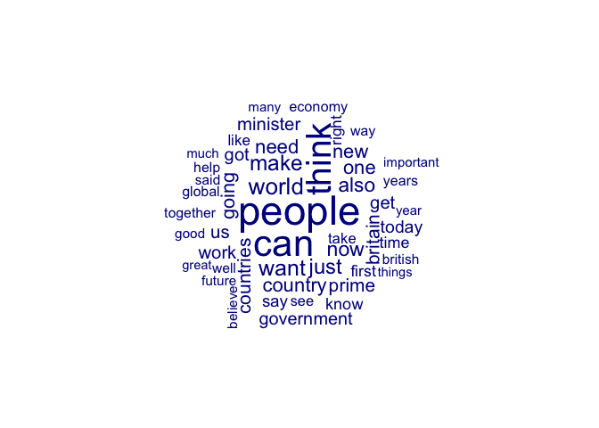
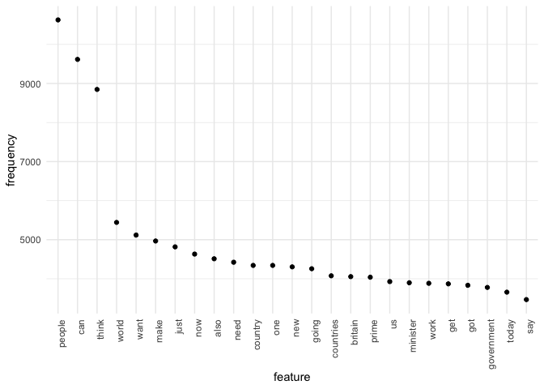

QTA Day 3: Reading in text data. Inspecting a dfm.
================

In this document we will go through the steps of going from raw texts to
a document term matrix that can be analyzed.

## Load libraries

``` r
library(quanteda)
library(stringr)
library(quanteda.textstats)
library(quanteda.textplots)
library(tidyverse)
```

## Reading in data

Let’s take a look a set of UK prime minister speeches from the
[EUSpeech](https://dataverse.harvard.edu/dataverse/euspeech) dataset.

Read in the speeches as follows using the `read.csv()` function:

``` r
speeches <- read.csv(file = "speeches_uk.csv", 
                     header = TRUE, 
                     stringsAsFactors = FALSE, 
                     sep = ",", 
                     encoding = "UTF-8")
```

This `read.csv()` call tells `R` that:

1.  speeches_uk.csv contains a header (i.e., variable names)
2.  we don’t want string variables to be turned into factors
3.  speeches_uk.csv separates variables using a comma
4.  the encoding is UTF_8, which refers to a particular way that bytes
    are turned into textual characters that we can read.

Let’s take a look at the structure of this dataset:

``` r
str(speeches)
```

    ## 'data.frame':    787 obs. of  6 variables:
    ##  $ id     : int  1 2 3 4 5 6 7 8 9 10 ...
    ##  $ text   : chr  "<p>This European Council has focused on 3 issues – the UK renegotiation, migration and terrorism.</p><p>I talke"| __truncated__ "<p>Thank you Prime Minister for welcoming me here to Warsaw.</p><p>It is an honour to be the first leader to ma"| __truncated__ "<p>Thank you President Iohannis for welcoming me to Bucharest today. It’s a pleasure to be here and to have had"| __truncated__ "<p>This is a government that delivers</p><p>Thank you very much for that brief introduction. It’s great to be h"| __truncated__ ...
    ##  $ title  : chr  "EU Council: PM press conference" "PM statement in Poland: 10 December 2015" "PM statement on talks in Romania, 9 December 2015" "PM Speech: This is a government that delivers" ...
    ##  $ date   : chr  "18-12-2015" "10-12-2015" "09-12-2015" "07-12-2015" ...
    ##  $ country: chr  "Great Britain" "Great Britain" "Great Britain" "Great Britain" ...
    ##  $ speaker: chr  "D. Cameron" "D. Cameron" "D. Cameron" "D. Cameron" ...

As you can see, the corpus contains 787 speeches and variables
containing meta data like speaker, country, date, etc. Take a look at a
few speeches. Let’s do some very light cleaning on these speeches, using
the `stringr` library, in particular the `str_replace_all()` we learned
about yesterday.

``` r
#remove html tags
speeches$text <- str_replace_all(speeches$text, "<.*?>", "")
#replace multiple white spaces with single white spaces
speeches$text <- str_squish(speeches$text)
```

*Question*: If this were a proper analysis, what other steps would you
take to further clean the data? Try out some additional cleaning steps.

Our speeches object is currently a dataframe. To be able to apply
functions in `quanteda` on this object it needs to recognize it as a
corpus object. In order to turn the dataframe into a corpus, use the
`corpus()` function

``` r
corpus_speeches <- corpus(speeches)

#the ndoc function displays the number of documents in the corpus
ndoc(corpus_speeches)
```

    ## [1] 787

Metadata such as speaker, date, etc. are stored in a corpus object as
docvars, and can be accessed like so (we’ll use the `head()` function to
limit the output):

``` r
#date
head(docvars(corpus_speeches, "date"), 10)
```

    ##  [1] "18-12-2015" "10-12-2015" "09-12-2015" "07-12-2015" "07-12-2015"
    ##  [6] "01-12-2015" "28-11-2015" "23-11-2015" "19-11-2015" "16-11-2015"

``` r
#speaker
head(docvars(corpus_speeches, "speaker"), 10)
```

    ##  [1] "D. Cameron" "D. Cameron" "D. Cameron" "D. Cameron" "D. Cameron"
    ##  [6] "D. Cameron" "D. Cameron" "D. Cameron" "D. Cameron" "D. Cameron"

``` r
#number of speeches per speaker

table(docvars(corpus_speeches, "speaker"))
```

    ## 
    ## D. Cameron   G. Brown   T. Blair 
    ##        493        283         11

Let’s tokenize this corpus

``` r
tokens_speech <- corpus_speeches %>%
    tokens(remove_punct = TRUE, padding = TRUE) %>%
  tokens_remove(stopwords("en")) %>%
  tokens_tolower()
```

Let’s check the most occurring collocations (this may take a few
seconds)

``` r
collocations <- tokens_speech %>%
  tokens_sample(size = 10, replace = FALSE) %>%
  textstat_collocations(min_count = 10) %>%
  arrange(-lambda)

head(collocations, 10)
```

    ##            collocation count count_nested length    lambda         z
    ## 10      united kingdom    12            0      2 10.094828  6.899604
    ## 3     northern ireland    39            0      2  9.978419 15.748796
    ## 12      economic cycle    16            0      2  9.724643  6.722794
    ## 5       interest rates    11            0      2  8.175360 12.988256
    ## 9          round world    10            0      2  7.366288  8.361329
    ## 4     prime minister:i    20            0      2  6.577236 13.348562
    ## 2            make sure    18            0      2  6.392485 16.009593
    ## 1       prime minister    41            0      2  6.309719 20.836352
    ## 6  prime minister:well    14            0      2  5.993638 12.385719
    ## 7         around world    11            0      2  5.861731 12.098494

If we want to add the most surprising collocations to our tokens object
we can do so using `tokens_compund`:

``` r
collocations <- collocations %>%
  filter(lambda > 10) %>%
  pull(collocation) %>%
  phrase()

tokens_speech <- tokens_compound(tokens_speech, collocations)
```

Let’s create a new tokens object, but this time we group it by speaker
by applying `tokens_group(groups = speaker)` This concatenates the
tokens in the speeches of all 3 speakers. We thus end up with a tokens
object that consists of 3 documents.

``` r
tokens_speech_speaker <- corpus_speeches %>%
  tokens(remove_punct = TRUE) %>%
  tokens_remove(stopwords("en")) %>%
  tokens_group(groups = speaker)

ndoc(tokens_speech_speaker)
```

    ## [1] 3

Let’s create a dfm

``` r
speeches_dfm_speaker <- dfm(tokens_speech_speaker)
```

It’s straightforward in **quanteda** to inspect a dfm. For example, the
`topfeatures()` function displays the most occurring features:

``` r
topfeatures(speeches_dfm_speaker, 20)
```

    ##    people       can     think     world      want      make      just       now 
    ##     10628      9617      8848      5443      5119      4967      4817      4632 
    ##      also      need       one   country       new     going countries   britain 
    ##      4512      4423      4342      4342      4305      4257      4076      4055 
    ##     prime        us  minister      work 
    ##      4040      3928      3898      3884

You can check the number of features in the dfm using the dim()
function:

``` r
dim(speeches_dfm_speaker)
```

    ## [1]     3 44617

There are over 44,000 features in this dfm. Let’s select those tokens
that appear at least 10 times by using the `dfm_trim()` function

``` r
speeches_dfm_speaker = dfm_trim(speeches_dfm_speaker, min_termfreq = 10)
dim(speeches_dfm_speaker)
```

    ## [1]    3 6951

As you can see, this reduces the size of the dfm considerably. However,
be mindful that applying such arbitrary cutoffs may remove meaningful
features.

*NB:* Because most words don’t occur in most documents, a dfm often
contains many zeroes (sparse). Internally, `quanteda` stores the dfm in
a sparse format, which means that the zeroes are not stored, so you can
create a dfm of many documents and many words without running into
memory problems.

## Visualization in quanteda

**quanteda** contains some very useful functions to plot your corpus in
order get a feel for it. For example, it is easy to construct a
wordcloud to see which features appear most often in your corpus.

``` r
textplot_wordcloud(speeches_dfm_speaker, max_words=50)
```

<!-- -->

A more informative frequency plot can be constructed as follows (using
the `ggplot2` library):

``` r
speeches_dfm_features <- textstat_frequency(speeches_dfm_speaker, n = 25)

# Sort by reverse frequency order
speeches_dfm_features$feature <- with(speeches_dfm_features , reorder(feature, -frequency))

ggplot(speeches_dfm_features, aes(x = feature, y = frequency)) +
    geom_point() + theme_minimal() + 
    theme(axis.text.x = element_text(angle = 90, hjust = 1))
```

<!-- -->

*NB* The `ggplot2` is a really nice library for making plots and
figures. If you have some time after this course is over, I strongly
recommend Kieran Healy’s [book](https://socviz.co/) on Data
Visualization for learning more about effective data viz. 

Let’s say we are interested in which words are spoken relatively more
often by David Cameron than by Tony Blair and Gordon Brown. For this we
can use `textstat_keyness()` and `textplot_keyness()` functions.

``` r
head(textstat_keyness(speeches_dfm_speaker, target = "D. Cameron"), 10)
```

    ##     feature     chi2 p n_target n_reference
    ## 1      good 454.6483 0     1970         579
    ## 2        eu 339.3730 0      792         123
    ## 3  eurozone 331.3737 0      466          11
    ## 4     syria 302.0232 0      428          11
    ## 5     think 277.5433 0     5761        3087
    ## 6    things 247.2193 0     1708         651
    ## 7     libya 247.0987 0      373          16
    ## 8        uk 238.7475 0     1154         364
    ## 9     terms 236.0412 0      825         205
    ## 10  britain 230.3162 0     2764        1291

``` r
textplot_keyness(textstat_keyness(speeches_dfm_speaker, target = "D. Cameron"), n = 10)
```

<!-- -->

*Question* How would you interpret this plot?

## Exercise

Apply `kwic()` to `tokens_speech` object and look up “european_union”.
Inspect the context in which the EU is mentioned.

Create a dfm from `tokens_speech` and call it `speeches_dfm`:

Check how many documents and features `speeches_dfm` has.

Trim `speeches_dfm` so that it only contains words that appear in at
least 20 speeches. Inspect the number of features.

Apply `textstat_keyness` to the `speeches_dfm_speaker` object to display
5 the most distinctive features for Gordon Brown
