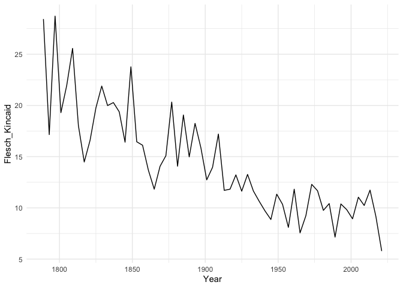

QTA Day 4: Describing and comparing text.
================

## Reading in data

``` r
#load libraries
library(quanteda)
library(stringr)
library(ggplot2)
library(quanteda.textmodels)
library(quanteda.textstats)

#read in speeches
speeches <- read.csv(file = "speeches_uk.csv", 
                     header = TRUE, 
                     stringsAsFactors = FALSE, 
                     sep = ",", 
                     encoding = "UTF-8")

#remove html tags
speeches$text <- str_replace_all(speeches$text, "<.*?>", "")
#replace multiple white spaces with single white spaces
speeches$text <- str_squish(speeches$text)

#construct a corpus
corpus_speeches <- corpus(speeches)
```

## Describing text

Let’s first take a look at language readability, as measured by Flesch
Kincaid. `Quanteda` contains quite a number of readability indices,
which can be called with the `textstat_readability()` function. Since
Flesch Kincaid is a weighted average of word length and sentence length
it requires the corpus to contain interpunction.

``` r
docvars(corpus_speeches, "flesch.kincaid") <- textstat_readability(corpus_speeches, "Flesch.Kincaid")[,2]
```

Let’s plot readability of PM speeches over time:

``` r
#turn the date variable in a date format instead of character format
docvars(corpus_speeches, "date") <- as.Date(docvars(corpus_speeches, "date"), "%d-%m-%Y")

#let's look at Cameron and Brown
corpus_cameron_brown <- corpus_subset(corpus_speeches, speaker != "T. Blair")

#make plot using ggplot
complexity_plot <- ggplot(docvars(corpus_cameron_brown), 
                          aes(x = date, 
                              y = flesch.kincaid, 
                              linetype = speaker))

complexity_plot <- complexity_plot + 
  geom_smooth(span = 0.5) + 
  theme_minimal()
print(complexity_plot)
```

<!-- -->

*Question*: How would you interpret this plot? Does it make sense to
apply a readability measure to a delivered speech?

We can use the `kwic()` to function to obtain the context in which
certain keywords appear. Let’s take a look at how David Cameron talked
about Syria:

``` r
corpus_cameron <- corpus_subset(corpus_speeches, speaker == "D. Cameron")
tokens_cameron <- tokens(corpus_cameron)

syria_kw <- kwic(tokens_cameron, 'syria')
nrow(syria_kw)
```

    ## [1] 428

``` r
head(syria_kw)
```

    ## Keyword-in-context with 6 matches.                                                        
    ##  [text1, 253] to resettle 22,000 refugees from | Syria |
    ##  [text1, 641] the efforts of the International | Syria |
    ##  [text1, 649]           to end the conflict in | Syria |
    ##  [text5, 581]    to the humanitarian crisis in | Syria |
    ##  [text5, 734]                 - in Iraq and in | Syria |
    ##  [text7, 734]           its importance? On the | Syria |
    ##                                    
    ##  over 2 years and to               
    ##  Support Group to end the          
    ##  through a political process.And we
    ##  - providing £ 1.1 billion.And     
    ##  where British fighter jets struck 
    ##  vote, can you just

The search for keywords can be generalized using wild card expressions
for pattern matches using `valuetype = "glob`. The search string can
also contain regular expressions. In that case use `valuetype = "regex`.

``` r
syria_kw <- kwic(tokens_cameron, 'syria*', valuetype = "glob")
nrow(syria_kw)
```

    ## [1] 614

``` r
head(syria_kw)
```

    ## Keyword-in-context with 6 matches.                                                                   
    ##  [text1, 162]   in humanitarian assistance for the |    Syrian    |
    ##  [text1, 253]     to resettle 22,000 refugees from |    Syria     |
    ##  [text1, 295] United Kingdom would resettle 20,000 |    Syrian    |
    ##  [text1, 316]         we have resettled over 1,000 |    Syrian    |
    ##  [text1, 378]            all those affected by the |    Syrian    |
    ##  [text1, 607]         the instability in Libya and | Syria.That's |
    ##                                        
    ##  conflict and deployed HMS Enterprise  
    ##  over 2 years and to                   
    ##  refugees during this Parliament.And we
    ##  refugees from camps in Turkey         
    ##  crisis with the conference we         
    ##  why it's so important that

Using `kwic(tokens_cameron, 'syria*', valuetype = "glob")`, the number
of hits increases considerably, now including different ways that Syria
appears in the text.

``` r
table(syria_kw$keyword)
```

    ## 
    ##              Syria      Syria-related          Syria.And      Syria.Britain 
    ##                428                  1                  2                  1 
    ##          Syria.But        Syria.Could          Syria.HMS            Syria.I 
    ##                  3                  1                  1                  3 
    ##           Syria.It          Syria.Let           Syria.Mr          Syria.Now 
    ##                  1                  3                  1                  4 
    ##           Syria.So         Syria.That       Syria.That's        Syria.There 
    ##                  1                  1                  1                  1 
    ##         Syria.This           Syria.We         Syria.Well Syria.Yes.Recently 
    ##                  2                  6                  1                  1 
    ##    Syria.Yes.There            Syria's          SyriaGood             Syrian 
    ##                  1                 10                  1                121 
    ##            Syrians       Syrians.That      Syrians.Third 
    ##                 16                  1                  1

As you can see, there are a few instances of incorrect interpunction,
where one sentence ends with Syria but there is no white space in
between it and the next sentence.

Let’s turn the corpus into a dfm using the `dfm()` function in
`quanteda`:

``` r
corpus_dfm <- corpus_speeches %>%
  tokens(remove_punct = TRUE) %>%
  tokens_remove(stopwords("en")) %>%
  dfm()
```

Let’s select those tokens that appear in at least 10 documents

``` r
corpus_dfm = dfm_trim(corpus_dfm, 
                      min_docfreq = 10)
corpus_dfm
```

    ## Document-feature matrix of: 787 documents, 6,110 features (91.77% sparse) and 6 docvars.
    ##        features
    ## docs    european council focused 3 issues uk renegotiation migration talked
    ##   text1       15       2       1 2      5  2             7         8      1
    ##   text2        4       0       0 1      0  3             0         0      0
    ##   text3        4       1       0 0      0  6             0         3      1
    ##   text4        0       2       0 1      0  0             0         0      2
    ##   text5        5       0       0 0      3  1             1         2      0
    ##   text6        0       0       0 0      0  0             0         0      0
    ##        features
    ## docs    last
    ##   text1   13
    ##   text2    3
    ##   text3    1
    ##   text4    4
    ##   text5    2
    ##   text6    0
    ## [ reached max_ndoc ... 781 more documents, reached max_nfeat ... 6,100 more features ]

The `textstat_simil()` function lets you calculate the cosine similarity
between individual speeches.

``` r
similarity <- textstat_simil(corpus_dfm, 
                             margin = "documents" , 
                             method = "cosine")
```

You can also use vector correlations as a similarity measure:

``` r
similarity <- textstat_simil(corpus_dfm, 
                             margin = "documents" , 
                             method = "correlation")
```

Let’s find the speeches most similar to the first speech using cosine
similarity

``` r
doc_similarity_cosine <- textstat_simil(corpus_dfm, 
                                        corpus_dfm["text1", ],                        
                                        margin = "documents", 
                                        method = "cosine")

doc_similarity_cosine <- as.data.frame(as.matrix(doc_similarity_cosine))

doc_similarity_cosine_sorted <- doc_similarity_cosine[order(doc_similarity_cosine$text1, 
                                                            decreasing = TRUE), , drop = FALSE]

head(doc_similarity_cosine_sorted)
```

    ##             text1
    ## text1   1.0000000
    ## text32  0.7427679
    ## text11  0.6938337
    ## text66  0.6711460
    ## text89  0.6585968
    ## text159 0.6414878

Let’s find the speeches most similar to the first speech using
correlation

``` r
doc_similarity_correlation <- textstat_simil(corpus_dfm, 
                                             corpus_dfm["text1", ],                              
                                             margin = "documents", 
                                             method = "correlation")

doc_similarity_correlation <- as.data.frame(as.matrix(doc_similarity_correlation))

doc_similarity_correlation_sorted <- doc_similarity_correlation[order(doc_similarity_correlation$text1, decreasing = TRUE), , drop = FALSE]

head(doc_similarity_correlation_sorted)
```

    ##             text1
    ## text1   1.0000000
    ## text32  0.7315030
    ## text11  0.6781084
    ## text66  0.6538998
    ## text89  0.6423192
    ## text159 0.6253999

*Question*: Take a look at speeches 1 and 32. Does it make sense that
they have high similarity scores?

For more similarity or distance measures check the `textstat_simil` and
`textstat_dist` reference manual by typing `?textstat_simil` or
`?textstat_dist` in your console.

## Exercises

Create a new tokens object, grouped by speaker and call it
`tokens_speech_speaker`

``` r
tokens_speech_speaker <- corpus_speeches %>%
  tokens(remove_punct = TRUE) %>%
  tokens_remove(stopwords("en")) %>%
  tokens_group(groups = speaker)
```

Let’s turn this corpus into a dfm and remove all words that occur fewer
than 20 times. Call this object `dfm_speech_speaker`:

``` r
dfm_speech_speaker <- dfm(tokens_speech_speaker) %>%
  dfm_trim(min_termfreq = 20)
```

Calculate the type to token ratio for all three speakers

``` r
textstat_lexdiv(dfm_speech_speaker, 
                measure = "TTR")
```

    ##     document        TTR
    ## 1 D. Cameron 0.00913460
    ## 2   G. Brown 0.01214433
    ## 3   T. Blair 0.17172791

The TTR is quite different for one speaker than for the others. Why is
that?

``` r
textstat_lexdiv(dfm_speech_speaker, 
                measure = "TTR")
```

    ##     document        TTR
    ## 1 D. Cameron 0.00913460
    ## 2   G. Brown 0.01214433
    ## 3   T. Blair 0.17172791

## Advanced

Try out to the following.

1)  Construct a corpus that consists of one speech of each speaker.
2)  Use `corpus_reshape` to tun break down the corpus on a sentence to
    sentence basis
3)  Calculate the TTR for each sentence in the corpus
4)  Visualise the distribution of the TTR for each speaker.
