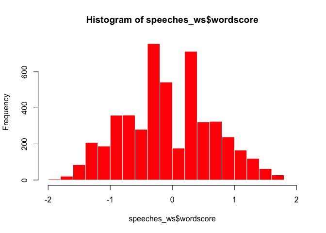
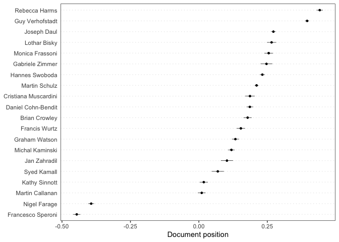
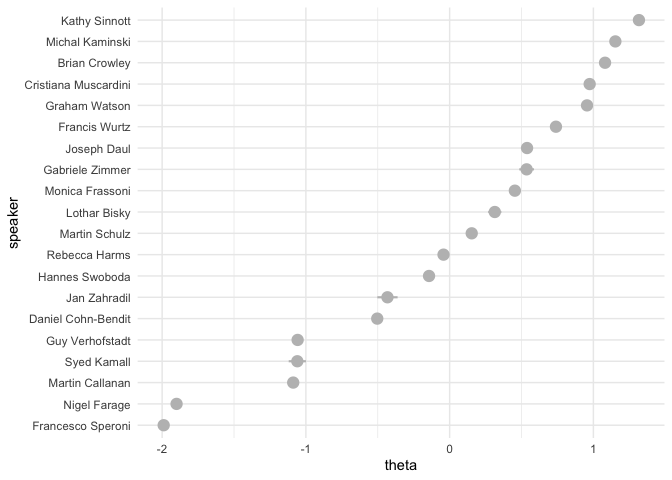
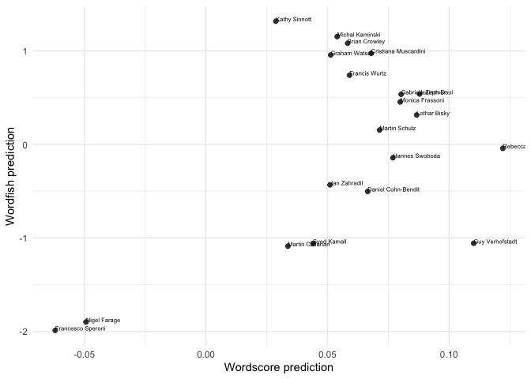
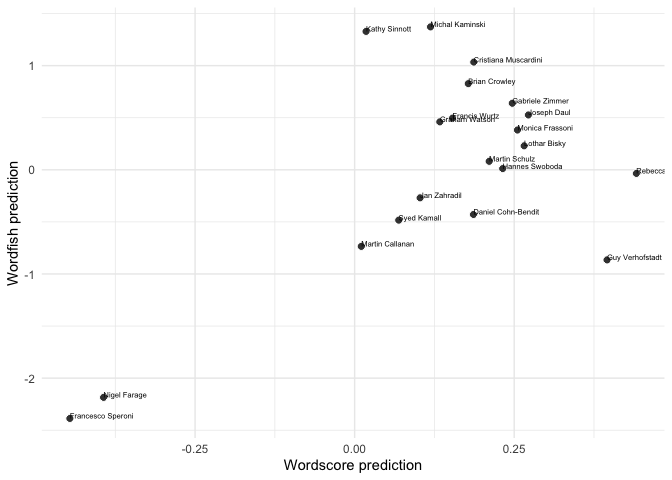

Scaling methods
================
19 July, 2022

This document gives some examples of how to apply scaling methods
(Wordscores, Wordfish) in **quanteda**. For these examples, we use the
(English) speeches of EP group leaders that are part of the
[EUSpeech](https://dataverse.harvard.edu/dataverse/euspeech) dataset.
The **quanteda**, **quanteda.textmodels**, **quanteda.textstats**,
**quanteda.textplots**, **ggplot2** and **tidyverse** libraries are
familiar at this point. The **quanteda.corpora** library can be
downloaded as follows:
`devtools::install_github("quanteda/quanteda.corpora")`.

``` r
#load libraries
library(quanteda)
library(quanteda.textmodels)
library(quanteda.textplots)
library(quanteda.corpora)
library(quanteda.textstats)
library(ggplot2)
library(tidyverse)

#read in the EP speeches
speeches <- read.csv(file = "speeches_ep.csv", 
                     header = TRUE, 
                     stringsAsFactors = FALSE, 
                     sep = ",", 
                     encoding = "UTF-8")

#take a look at how many unique speakers there are in the dataset
unique(speeches$speaker)
```

    ##  [1] "Lothar Bisky"         "Martin Callanan"      "Daniel Cohn-Bendit"  
    ##  [4] "Brian Crowley"        "Joseph Daul"          "Marcel de Graaff"    
    ##  [7] "Nigel Farage"         "Monica Frassoni"      "Rebecca Harms"       
    ## [10] "Syed Kamall"          "Michal Kaminski"      "Philippe Lamberts"   
    ## [13] "Cristiana Muscardini" "Martin Schulz"        "Kathy Sinnott"       
    ## [16] "Francesco Speroni"    "Hannes Swoboda"       "Guy Verhofstadt"     
    ## [19] "Graham Watson"        "Francis Wurtz"        "Jan Zahradil"        
    ## [22] "Gabriele Zimmer"

MEP speeches are full of jargon. Let’s add collocations to our tokens
object.

Let’s first append the speeches for each speaker using some tidyverse
data-wrangling.

``` r
#the `%>%` command is the pipe function and helps us with a chain of functions
#think of it as `then`:
#take the speeches dataframe, then
#group by variable, then
#paste speeches together.

speeches <- speeches %>%
  group_by(speaker) %>%
  summarise(text = paste(text, collapse = " ")) %>%
  ungroup()

#confirm that you have a total of 22 (very long) concatenated speeches, 1 for each EP speaker
dim(speeches)
```

    ## [1] 22  2

Let’s first tokenise this corpus.

``` r
#create a corpus object
corpus_speeches <- corpus(speeches)

#tokenise the corpus

tokens_speeches <- tokens(corpus_speeches,
                          what = "word",
                          remove_punct = TRUE, 
                          remove_symbols = TRUE, 
                          remove_numbers = TRUE,
                          remove_url = TRUE,
                          remove_separators = TRUE,
                          split_hyphens = FALSE,
                          ) %>%
  tokens_remove(stopwords(source = "smart"), padding = TRUE)
```

Let’s remove two speakers for whom we have comparatively little data
(fewer than 2000 tokens). We end up with 20 speakers in total

``` r
tokens_speeches <- tokens_subset(tokens_speeches, ntoken(tokens_speeches) > 2000)
```

MEP speeches are full of jargon and references to politicians. Let’s
append bigram collocations to our tokens object to account for this.

``` r
collocations <- tokens_speeches %>%
  tokens_sample(size = 10, replace = FALSE) %>%
  textstat_collocations(min_count = 10,
                        size = 2:3) %>%
  arrange(-lambda)

head(collocations, 50)
```

    ##                  collocation count count_nested length    lambda         z
    ## 352             liam aylward    13           12      2 16.886644  8.366210
    ## 353                eoin ryan    11           11      2 16.726306  8.273703
    ## 342          bashar al-assad    10            3      2 15.536722  9.348778
    ## 324               van rompuy    60           60      2 15.442018 10.601136
    ## 335                   seán ó    11           11      2 15.116863  9.585778
    ## 336              ó neachtain    11           11      2 15.116863  9.585778
    ## 294             aylward seán    10           10      2 13.590805 13.278315
    ## 344             21st century    25            5      2 13.444993  9.337889
    ## 255          baroness ashton    40           12      2 13.390026 15.441239
    ## 274                 red tape    19            6      2 13.020217 14.512598
    ## 350                 ryan UEN    11           11      2 12.834426  8.798600
    ## 290             stress tests    13            4      2 11.856141 13.424789
    ## 171                blue card    14            7      2 11.852125 19.123308
    ## 182 medium-sized enterprises    13            2      2 11.744948 18.534241
    ## 291          transaction tax    28           28      2 11.314620 13.403768
    ## 177             closed doors    13            0      2 11.192862 18.735484
    ## 17            prime minister   197          127      2 11.186272 38.650102
    ## 257                   le pen    10           10      2 11.175689 15.239349
    ## 306             19th century    11            1      2 11.161676 12.665628
    ## 361  catch-the-eye procedure    12            2      2 11.108869  7.690254
    ## 110            death penalty    26            0      2 11.052210 22.001542
    ## 365           power stations    11            9      2 10.923775  7.550713
    ## 49               middle east    43            8      2 10.849411 27.431882
    ## 81           rating agencies    19           11      2 10.591153 24.025911
    ## 211          civil liberties    16            8      2 10.587395 17.467632
    ## 243           united kingdom    34            5      2 10.541732 15.967540
    ## 313               tax havens    14            5      2 10.497928 12.162374
    ## 264              hedge funds    14            5      2 10.399722 14.961656
    ## 194          redemption fund    34            8      2 10.283896 18.119125
    ## 44            interest rates    53           27      2  9.977006 28.274230
    ## 128     progressive alliance    15            0      2  9.972821 21.079619
    ## 283             EUR trillion    13            8      2  9.792104 14.098842
    ## 242           fiscal compact    13            2      2  9.787219 16.060782
    ## 127  infringement procedures    11            3      2  9.746148 21.094241
    ## 64             latin america    21            4      2  9.738532 25.044347
    ## 12               EUR billion    85           36      2  9.738516 41.001695
    ## 50       christian democrats    38           31      2  9.657152 27.355180
    ## 183      jean-claude juncker    11            9      2  9.416267 18.531203
    ## 323          eurobond market    11            3      2  9.356042 10.750475
    ## 284    financial transaction    27           27      2  9.332250 14.085871
    ## 218            mrs malmström    15            6      2  9.278158 17.096302
    ## 23            speaker agreed    55            0      2  9.266495 35.876333
    ## 298   millennium development    10           10      2  9.205390 13.003114
    ## 262          public finances    13            8      2  9.085219 15.027229
    ## 69            czech republic    16            2      2  9.084478 24.797315
    ## 196              joseph daul    11            5      2  9.067389 18.024263
    ## 123         guarantee scheme    14            4      2  9.038193 21.334462
    ## 24       high representative    46           13      2  9.029160 35.146684
    ## 77              north africa    18            0      2  8.955351 24.388480
    ## 179               votes cast    10            7      2  8.911589 18.666330

If we want to add the most surprising collocations to our tokens object
we can do so using `tokens_compund`:

``` r
collocations <- collocations %>%
  filter(lambda > 2) %>%
  pull(collocation) %>%
  phrase()

tokens_speeches <- tokens_compound(tokens_speeches, collocations)
```

Let’s include only those tokens that are included by at least 5 speakers

``` r
dfm_speeches <- dfm(tokens_speeches) %>%
  dfm_trim(min_docfreq = 5, docfreq_type = "count")

#check the number of documents and features
dim(dfm_speeches)
```

    ## [1]   20 5236

``` r
#change the document names to the speaker names
docnames(dfm_speeches) <- docvars(dfm_speeches, "speaker")
```

## Wordscores

Let’s see if we can use Wordscores to locate these speakers on a
pro-anti EU dimension. We’ll first need to determine reference texts to
anchor this dimension. On the anti-EU side we’ll locate Francesco
Speroni, for obvious reasons, and on the pro-EU dimension we’ll locate
Guy Verhofstadt, leader of the liberal ALDE group, and a pro-EU voice:

``` r
#append an empty reference.score variable to the speeches_dfm docvars
docvars(dfm_speeches, "reference.score") <- NA

#locate which rows correspond with Guy Verhofstadt (pro.eu) and Francesco Speroni (anti.eu)
pro.eu <- which(docvars(dfm_speeches) == "Guy Verhofstadt")
anti.eu <- which(docvars(dfm_speeches) == "Francesco Speroni" |
                 docvars(dfm_speeches) == "Nigel Farage" )

#assign reference scores to Guy Verhofstadt (1) and Francesco Speroni (-1)
docvars(dfm_speeches, "reference.score")[pro.eu] <- 1
docvars(dfm_speeches, "reference.score")[anti.eu] <- -1

#inspects the reference.score variable:
docvars(dfm_speeches, "reference.score")
```

    ##  [1] NA NA NA -1 NA NA NA  1 NA NA NA NA NA NA NA NA NA -1 NA NA

``` r
#implement wordscores as per Laver, Benoit, Garry (2003)
speeches_ws <- textmodel_wordscores(dfm_speeches, 
                                    y = docvars(dfm_speeches, "reference.score"), 
                                    scale = c("linear"), 
                                    smooth = 1)
summary(speeches_ws, 10)
```

    ## 
    ## Call:
    ## textmodel_wordscores.dfm(x = dfm_speeches, y = docvars(dfm_speeches, 
    ##     "reference.score"), scale = c("linear"), smooth = 1)
    ## 
    ## Reference Document Statistics:
    ##                      score  total min   max   mean median
    ## Brian Crowley           NA  29978   0 19692  5.725      0
    ## Cristiana Muscardini    NA  16373   0 10020  3.127      0
    ## Daniel Cohn-Bendit      NA  42285   0 28977  8.076      1
    ## Francesco Speroni       -1  33579   0 22696  6.413      0
    ## Francis Wurtz           NA  22572   0 14093  4.311      0
    ## Gabriele Zimmer         NA  11581   0  7486  2.212      0
    ## Graham Watson           NA  31255   0 19170  5.969      1
    ## Guy Verhofstadt          1  96056   0 65971 18.345      1
    ## Hannes Swoboda          NA  74778   0 50473 14.282      1
    ## Jan Zahradil            NA  11949   0  8069  2.282      0
    ## Joseph Daul             NA  82295   0 51802 15.717      2
    ## Kathy Sinnott           NA  27565   0 17591  5.265      0
    ## Lothar Bisky            NA  18850   0 11716  3.600      0
    ## Martin Callanan         NA  32282   0 21182  6.165      1
    ## Martin Schulz           NA 119795   0 80213 22.879      3
    ## Michal Kaminski         NA  39095   0 23806  7.467      1
    ## Monica Frassoni         NA  23183   0 15369  4.428      0
    ## Nigel Farage            -1  52013   0 35369  9.934      1
    ## Rebecca Harms           NA  40180   0 26841  7.674      1
    ## Syed Kamall             NA  13601   0  8983  2.598      0
    ## 
    ## Wordscores:
    ## (showing first 10 elements)
    ##                            mr_president president-in-office             council 
    ##             -0.2974             -0.3742             -0.3441              0.8322 
    ##           president          commission     council_meeting               place 
    ##             -0.3087              0.4006             -0.4493             -0.7170 
    ##               month               focus 
    ##             -0.4996             -0.2117

``` r
#sort most discriminant words:

#anti-EU words
head(sort(speeches_ws$wordscores), 10)
```

    ##         anthem         nation   increasingly    referendums        croatia 
    ##     -0.9722533     -0.9704005     -0.9696250     -0.9692743     -0.9678999 
    ##         ignore        writing        trapped mr_verhofstadt     referendum 
    ##     -0.9660694     -0.9657479     -0.9644416     -0.9620543     -0.9603995

``` r
#pro-EU words
tail(sort(speeches_ws$wordscores), 10)
```

    ##    immediately     discussion        reforms      sanctions stability_pact 
    ##      0.7376229      0.7524553      0.7592599      0.7776002      0.7831080 
    ##           task     colleagues responsibility        finally        council 
    ##      0.7981078      0.8151527      0.8151527      0.8295436      0.8321874

``` r
#histogram of wordscores
hist(speeches_ws$wordscore, col = "red", border = 0)
```

<!-- -->

Let’s use the Wordscores model to predict the document scores of the
speeches of the 17 remaining group leaders

``` r
speeches_wordscores_predict <- predict(speeches_ws,
                                       newdata = dfm_speeches, 
                                       se = TRUE)

#which speakers are most like Farage
sort(speeches_wordscores_predict$fit, decreasing = FALSE)[1:5]
```

    ## Francesco Speroni      Nigel Farage     Kathy Sinnott   Martin Callanan 
    ##        -0.3785835        -0.3699552        -0.3287162        -0.3165846 
    ##   Michal Kaminski 
    ##        -0.3068039

``` r
#which speakers are most like Verhofstadt
sort(speeches_wordscores_predict$fit, decreasing = TRUE)[1:5]
```

    ## Guy Verhofstadt     Joseph Daul Monica Frassoni  Hannes Swoboda   Rebecca Harms 
    ##      -0.2273880      -0.2751074      -0.2814043      -0.2826899      -0.2827562

Visualize the document scores in a plot:

``` r
textplot_scale1d(speeches_wordscores_predict)
```

<!-- -->

## Wordfish

Estimate a Wordfish model and inspect its output. Using the argument
`dir=c(4,8)` set the direction of the dimension so that the document
score for Guy Verhofstadt (speaker 4) is smaller than the document score
for Francisco Peroni (speaker 8)

``` r
speeches_wf <- textmodel_wordfish(dfm_speeches,
                                  dir = c(4,8))
summary(speeches_wf)
```

    ## 
    ## Call:
    ## textmodel_wordfish.dfm(x = dfm_speeches, dir = c(4, 8))
    ## 
    ## Estimated Document Positions:
    ##                          theta      se
    ## Brian Crowley         0.668023 0.02145
    ## Cristiana Muscardini  1.180868 0.02451
    ## Daniel Cohn-Bendit   -0.440898 0.02172
    ## Francesco Speroni    -2.304964 0.01888
    ## Francis Wurtz         0.552784 0.02546
    ## Gabriele Zimmer       0.549173 0.03557
    ## Graham Watson         0.530208 0.02176
    ## Guy Verhofstadt      -0.773695 0.01455
    ## Hannes Swoboda       -0.089729 0.01579
    ## Jan Zahradil         -0.323772 0.04048
    ## Joseph Daul           0.669624 0.01294
    ## Kathy Sinnott         1.143698 0.01917
    ## Lothar Bisky          0.350814 0.02917
    ## Martin Callanan      -0.836702 0.02507
    ## Martin Schulz        -0.009584 0.01234
    ## Michal Kaminski       1.535364 0.01347
    ## Monica Frassoni       0.382515 0.02613
    ## Nigel Farage         -2.160224 0.01588
    ## Rebecca Harms        -0.079369 0.02151
    ## Syed Kamall          -0.544133 0.03848
    ## 
    ## Estimated Feature Scores:
    ##               mr_president president-in-office council president commission
    ## beta -0.02862      -0.0705              0.5495  0.1045   -0.1124    0.03497
    ## psi  10.19941       4.2483              2.2728  4.1941    3.9058    4.44922
    ##      council_meeting   place   month  focus economic affairs european_union
    ## beta         -0.0890 0.01116 -0.2989 0.4328 -0.02382  0.2792       -0.02386
    ## psi           0.5751 3.09213  1.1945 1.8851  3.56544  1.3441        4.38743
    ##      proposals created return economy previous   state implemented immediately
    ## beta    0.1463  0.1439 0.1179  0.2942   0.1052 -0.2071      0.2683     0.06619
    ## psi     2.5275  1.5640 1.8702  2.7975   1.4047  3.3636      1.2921     1.51999
    ##      restart    today  speak future  europe  people   claim   care situation
    ## beta  0.1483 -0.03024 0.2686 0.2209 0.01236 -0.2441 -0.1435 0.1887    0.1826
    ## psi  -1.0441  4.11147 2.4654 3.5357 5.08941  4.6085  0.8304 1.4152    3.3787

Let’s take out the word level parameters beta and psi

``` r
wordfish_word_data <- data.frame(beta = speeches_wf$beta,
                            psi = speeches_wf$psi,
                            features = speeches_wf$features)

dim(wordfish_word_data)
```

    ## [1] 5236    3

``` r
head(wordfish_word_data)
```

    ##          beta       psi            features
    ## 1 -0.02861738 10.199413                    
    ## 2 -0.07049655  4.248310        mr_president
    ## 3  0.54951484  2.272820 president-in-office
    ## 4  0.10447192  4.194117             council
    ## 5 -0.11243013  3.905771           president
    ## 6  0.03496841  4.449215          commission

``` r
word_plot <- ggplot(data = wordfish_word_data, aes(x = beta, y = psi)) +
    geom_point(pch = 21, fill = "gray", color = "white", size = 0.75) +
  labs(x = "Beta", y = "Psi") + guides(size = "none", color = guide_legend("")) + 
  theme_minimal() +
  geom_text(data=subset(wordfish_word_data, beta > 3 | beta < -1.6 | psi > 4.5),  
            aes(x = beta, y = psi, label = features))

print(word_plot)
```

<!-- -->

*Question*: How would you interpret the word plot?

Plot the document positions generated by Wordfish:

``` r
#generate a dataframe with document level alpha beta and omega
wordfish_document_data <- data.frame(alpha = speeches_wf$alpha,
                                     theta = speeches_wf$theta,
                                     se = speeches_wf$se.theta,
                                     speaker = speeches_wf$docs)

#order the speaker factor by theta
wordfish_document_data$speaker <- reorder(wordfish_document_data$speaker, 
                                           wordfish_document_data$theta)


#plot wordfish results using ggplot2
wordfish_plot <- ggplot(wordfish_document_data, 
                        aes(x= speaker, 
                            y = theta,
                            ymin = theta -1.96*se,
                            ymax = theta + 1.96*se)) +
  geom_pointrange(pch = 21, fill = "gray", color = "gray", size = 0.75) +
  theme_minimal() + coord_flip()
print(wordfish_plot)
```

<!-- -->

Both Wordscores and Wordfish are scaling models and if they pick up on
the same dimension they should give us similar results. Let’s see if
this indeed the case.

``` r
scaling_data <- rbind(data.frame(speeches_wordscores_predict, wordfish_document_data))

scaling_plot <- ggplot(scaling_data, aes(x = fit, 
                                         y = theta, 
                                         label = speaker)) +
  geom_point(pch = 21, fill = "gray25", color = "white", size = 2.5) +
  scale_x_continuous(name = "Wordscore prediction") +
  scale_y_continuous(name = "Wordfish prediction") +
  theme_minimal() + geom_text(aes(label=speaker), 
                                        hjust=0, 
                                        vjust=0, 
                                        size = 2)
  
print(scaling_plot)
```

<!-- -->

``` r
correlation <- cor.test(x=scaling_data$fit, 
                        y=scaling_data$theta,
                        method = 'spearman')
print(correlation)
```

    ## 
    ##  Spearman's rank correlation rho
    ## 
    ## data:  scaling_data$fit and scaling_data$theta
    ## S = 1182, p-value = 0.6396
    ## alternative hypothesis: true rho is not equal to 0
    ## sample estimates:
    ##       rho 
    ## 0.1112782

Not really.

## Latent semantic scaling (LSS)

If you are motivated, work your way through this LSS tutorial:
<https://tutorials.quanteda.io/machine-learning/lss/>

## Exercises

For this set of exercises we will use `data_corpus_irishbudget2010` a
corpus that consists of 2010 budget speeches in Ireland. The dataset is
included in the quanteda package.

1.  Tokenize `data_corpus_irishbudget2010`, remove stopwords,
    punctuation characters, and create a dfm called `dfm_budget_debates`

2.  Create a variable `ref_score` that equals 1 if the speaker’s name is
    “Lenihan” (i.e., the Minister of Finance at the time) and -1 if the
    speaker’s name is “Kenny” (Enda Kenny was leader of the opposition
    at the time). For all other speakers, assign the value NA.

3.  Apply a Wordscores model for this document-feature matrix using
    `ref_score` as the value for `y`.

4.  Explore the scores for all words in the dfm using
    `textplot_scale1d()`. Note: set margin to “features”. Why are some
    terms clustered around -1 and +1?

5.  Use `predict()` for predicting the document-level word scores for
    all documents in the dfm. Set `se = TRUE` to add 95% confidence
    intervals.

6.  Apply `textplot_scale1d()` to the object created in question 5. Does
    this method distinguish between government (FF and Green) and
    oppoisiton parties?

7.  Use the `dfm_budget_debates`. Create a new dfm object that only
    keeps terms that appear in at least three documents and that appear
    at least three times. Call the resulting dfm
    `dfm_budget_debates_trimmed`

8.  Run a Wordfish model on this dfm.

9.  Use `textplot_scale1d()` to plot (1) document-positions, and scores
    for each word. You can achieve this by adjusting the `margin`
    argument.
