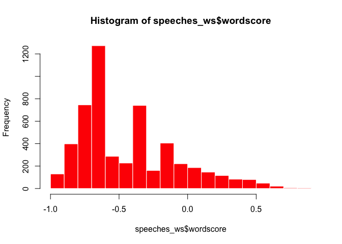
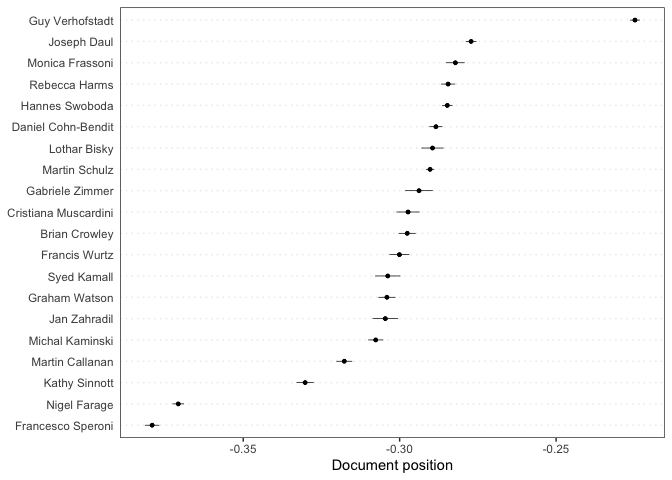
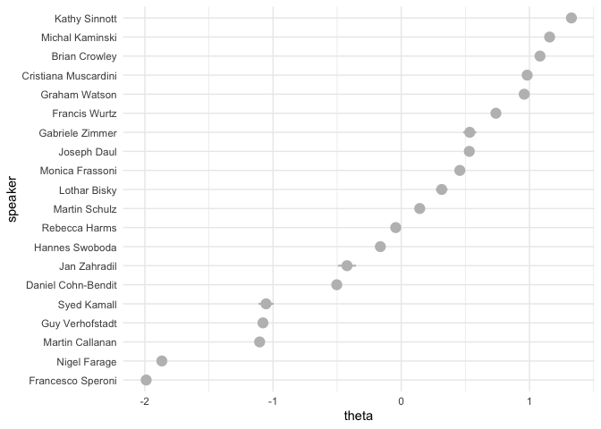
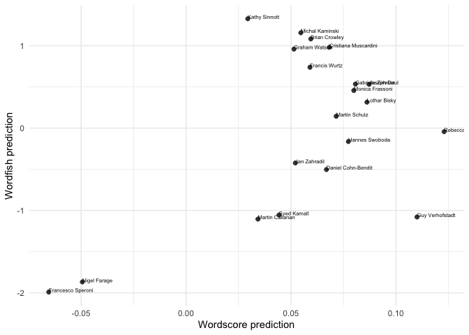
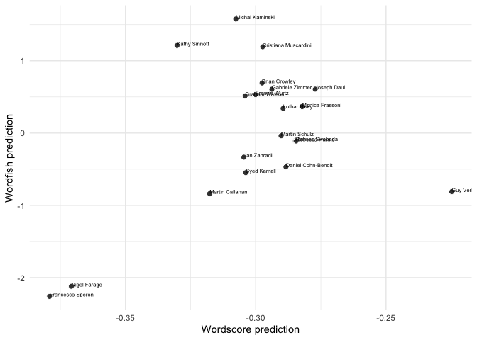
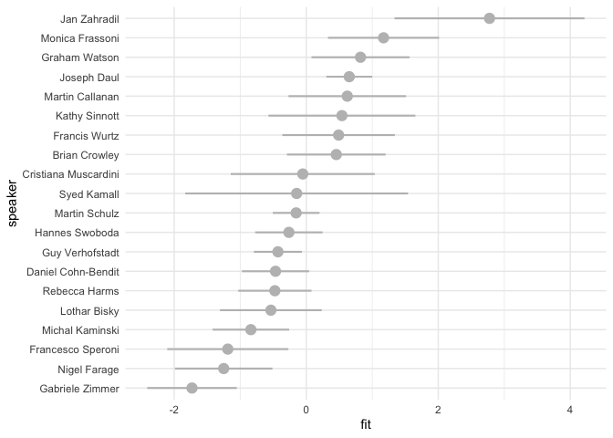
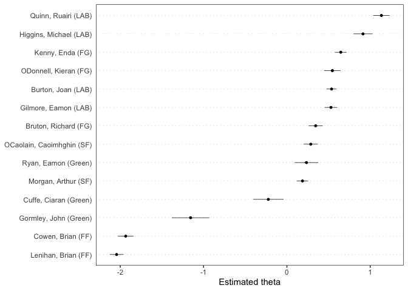

Scaling methods
================
20 July, 2022

This document gives some examples of how to apply scaling methods
(Wordscores, Wordfish) in **quanteda**. For these examples, we use the
(English) speeches of EP group leaders that are part of the
[EUSpeech](https://dataverse.harvard.edu/dataverse/euspeech) dataset.
The **quanteda**, **quanteda.textmodels**, **quanteda.textstats**,
**quanteda.textplots**, **ggplot2** and **tidyverse** libraries are
familiar at this point. The **quanteda.corpora** library can be
downloaded as follows:
`devtools::install_github("quanteda/quanteda.corpora")`.

``` r
#load libraries
library(quanteda)
library(quanteda.textmodels)
library(quanteda.textplots)
library(quanteda.corpora)
library(quanteda.textstats)
library(ggplot2)
library(tidyverse)

#read in the EP speeches
speeches <- read.csv(file = "speeches_ep.csv", 
                     header = TRUE, 
                     stringsAsFactors = FALSE, 
                     sep = ",", 
                     encoding = "UTF-8")

#take a look at how many unique speakers there are in the dataset
unique(speeches$speaker)
```

    ##  [1] "Lothar Bisky"         "Martin Callanan"      "Daniel Cohn-Bendit"  
    ##  [4] "Brian Crowley"        "Joseph Daul"          "Marcel de Graaff"    
    ##  [7] "Nigel Farage"         "Monica Frassoni"      "Rebecca Harms"       
    ## [10] "Syed Kamall"          "Michal Kaminski"      "Philippe Lamberts"   
    ## [13] "Cristiana Muscardini" "Martin Schulz"        "Kathy Sinnott"       
    ## [16] "Francesco Speroni"    "Hannes Swoboda"       "Guy Verhofstadt"     
    ## [19] "Graham Watson"        "Francis Wurtz"        "Jan Zahradil"        
    ## [22] "Gabriele Zimmer"

MEP speeches are full of jargon. Let’s add collocations to our tokens
object.

Let’s first append the speeches for each speaker using some tidyverse
data-wrangling.

``` r
#the `%>%` command is the pipe function and helps us with a chain of functions
#think of it as `then`:
#take the speeches dataframe, then
#group by variable, then
#paste speeches together.

speeches <- speeches %>%
  group_by(speaker) %>%
  summarise(text = paste(text, collapse = " ")) %>%
  ungroup()

#confirm that you have a total of 22 (very long) concatenated speeches, 1 for each EP speaker
dim(speeches)
```

    ## [1] 22  2

Let’s first tokenise this corpus.

``` r
#create a corpus object
corpus_speeches <- corpus(speeches)

#tokenise the corpus

tokens_speeches <- tokens(corpus_speeches,
                          what = "word",
                          remove_punct = TRUE, 
                          remove_symbols = TRUE, 
                          remove_numbers = TRUE,
                          remove_url = TRUE,
                          remove_separators = TRUE,
                          split_hyphens = FALSE,
                          ) %>%
  tokens_remove(stopwords(source = "smart"), padding = TRUE)
```

Let’s remove two speakers for whom we have comparatively little data
(fewer than 2000 tokens). We end up with 20 speakers in total

``` r
tokens_speeches <- tokens_subset(tokens_speeches, ntoken(tokens_speeches) > 2000)
```

MEP speeches are full of jargon and references to politicians. Let’s
append bigram collocations to our tokens object to account for this.

``` r
collocations <- tokens_speeches %>%
  tokens_sample(size = 10, replace = FALSE) %>%
  textstat_collocations(min_count = 10,
                        size = 2:3) %>%
  arrange(-lambda)

head(collocations, 50)
```

    ##                  collocation count count_nested length    lambda         z
    ## 407             liam aylward    13           12      2 17.029761  8.437115
    ## 408                verts ALE    13           13      2 17.029761  8.437115
    ## 409                eoin ryan    11           11      2 16.869423  8.344496
    ## 371               van rompuy   119          119      2 16.376927 11.231791
    ## 396                   seán ó    11           11      2 15.259980  9.676531
    ## 397              ó neachtain    11           11      2 15.259980  9.676531
    ## 394             saudi arabia    11            4      2 14.923506  9.688397
    ## 398                blue card    10           10      2 14.832536  9.612578
    ## 335              josé manuel    11           10      2 14.161366 13.184776
    ## 186          baroness ashton    71           36      2 14.142742 19.626588
    ## 317          colonel gaddafi    14            5      2 13.805370 14.105803
    ## 331             aylward seán    10           10      2 13.733922 13.418143
    ## 304                 red tape    22            7      2 13.608722 14.948680
    ## 399             21st century    26            7      2 13.593249  9.446763
    ## 403                 ryan UEN    11           11      2 12.977550  8.896719
    ## 255            olympic games    16            3      2 12.787752 16.816453
    ## 405             stress tests    13            5      2 12.685873  8.753979
    ## 118 medium-sized enterprises    32            5      2 12.635242 22.408024
    ## 410              tax evasion    28           13      2 11.904441  8.333298
    ## 235       renewable energies    12            5      2 11.871367 17.644464
    ## 214         founding fathers    11            1      2 11.763451 18.550781
    ## 413               tax havens    21            4      2 11.583911  8.086741
    ## 414  catch-the-eye procedure    12            2      2 11.372786  7.871337
    ## 110            death penalty    24            1      2 11.347143 22.997782
    ## 327          transaction tax    43           43      2 11.316976 13.567027
    ## 340               gaza strip    12            0      2 11.238959 12.837435
    ## 156             closed doors    14            0      2 11.168929 20.676844
    ## 36               middle east    65           16      2 11.138695 33.433433
    ## 151     progressive alliance    28            0      2 11.136967 21.015333
    ## 211           sakharov prize    12            4      2 11.041953 18.637572
    ## 16            prime minister   241          170      2 10.979275 43.489778
    ## 348              hedge funds    13            5      2 10.913704 12.568689
    ## 97           rating agencies    19           14      2 10.894628 23.933763
    ## 47       christian democrats   113          109      2 10.891457 29.621578
    ## 356            marshall plan    10            2      2 10.585913 12.031180
    ## 251          civil liberties    12            7      2 10.564143 16.932546
    ## 355               ms lulling    12            7      2 10.550666 12.129453
    ## 362            angela merkel    10            6      2 10.386319 11.821295
    ## 270                 road map    10            1      2 10.257721 16.187083
    ## 291           united kingdom    31            5      2 10.155622 15.377023
    ## 309           global warming    14            4      2 10.139689 14.659124
    ## 419              fifty years    11            9      2 10.136302  7.012530
    ## 32           party christian   107          107      2 10.105518 34.572585
    ## 74             latin america    23            4      2 10.078999 25.614872
    ## 24               EUR billion    69           37      2  9.982863 38.527531
    ## 302    financial transaction    42           42      2  9.785057 14.995455
    ## 324           power stations    13           10      2  9.525523 13.754843
    ## 144          western balkans    10            2      2  9.453881 21.242004
    ## 14            people's party   123          122      2  9.415850 45.479678
    ## 69        youth unemployment    28            5      2  9.305561 26.261228

If we want to add the most surprising collocations to our tokens object
we can do so using `tokens_compund`:

``` r
collocations <- collocations %>%
  filter(lambda > 2) %>%
  pull(collocation) %>%
  phrase()

tokens_speeches <- tokens_compound(tokens_speeches, collocations)
```

Let’s include only those tokens that are included by at least 5 speakers

``` r
dfm_speeches <- dfm(tokens_speeches) %>%
  dfm_trim(min_docfreq = 5, docfreq_type = "count")

#check the number of documents and features
dim(dfm_speeches)
```

    ## [1]   20 5282

``` r
#change the document names to the speaker names
docnames(dfm_speeches) <- docvars(dfm_speeches, "speaker")
```

## Wordscores

Let’s see if we can use Wordscores to locate these speakers on a
pro-anti EU dimension. We’ll first need to determine reference texts to
anchor this dimension. On the anti-EU side we’ll locate Francesco
Speroni, for obvious reasons, and on the pro-EU dimension we’ll locate
Guy Verhofstadt, leader of the liberal ALDE group, and a pro-EU voice:

``` r
#append an empty reference.score variable to the speeches_dfm docvars
docvars(dfm_speeches, "reference.score") <- NA

#locate which rows correspond with Guy Verhofstadt (pro.eu) and Francesco Speroni (anti.eu)
pro.eu <- which(docvars(dfm_speeches) == "Guy Verhofstadt")
anti.eu <- which(docvars(dfm_speeches) == "Francesco Speroni" |
                 docvars(dfm_speeches) == "Nigel Farage" )

#assign reference scores to Guy Verhofstadt (1) and Francesco Speroni (-1)
docvars(dfm_speeches, "reference.score")[pro.eu] <- 1
docvars(dfm_speeches, "reference.score")[anti.eu] <- -1

#inspects the reference.score variable:
docvars(dfm_speeches, "reference.score")
```

    ##  [1] NA NA NA -1 NA NA NA  1 NA NA NA NA NA NA NA NA NA -1 NA NA

``` r
#implement wordscores as per Laver, Benoit, Garry (2003)
speeches_ws <- textmodel_wordscores(dfm_speeches, 
                                    y = docvars(dfm_speeches, "reference.score"), 
                                    scale = c("linear"), 
                                    smooth = 1)
summary(speeches_ws, 10)
```

    ## 
    ## Call:
    ## textmodel_wordscores.dfm(x = dfm_speeches, y = docvars(dfm_speeches, 
    ##     "reference.score"), scale = c("linear"), smooth = 1)
    ## 
    ## Reference Document Statistics:
    ##                      score  total min   max   mean median
    ## Brian Crowley           NA  29943   0 19692  5.669      0
    ## Cristiana Muscardini    NA  16345   0 10020  3.094      0
    ## Daniel Cohn-Bendit      NA  42046   0 28977  7.960      1
    ## Francesco Speroni       -1  33564   0 22696  6.354      0
    ## Francis Wurtz           NA  22494   0 14093  4.259      0
    ## Gabriele Zimmer         NA  11599   0  7486  2.196      0
    ## Graham Watson           NA  31267   0 19170  5.920      1
    ## Guy Verhofstadt          1  96856   0 65971 18.337      1
    ## Hannes Swoboda          NA  74328   0 50473 14.072      1
    ## Jan Zahradil            NA  11936   0  8069  2.260      0
    ## Joseph Daul             NA  81383   0 51802 15.408      2
    ## Kathy Sinnott           NA  27557   0 17591  5.217      0
    ## Lothar Bisky            NA  18798   0 11716  3.559      0
    ## Martin Callanan         NA  32260   0 21182  6.108      1
    ## Martin Schulz           NA 119525   0 80213 22.629      3
    ## Michal Kaminski         NA  39061   0 23806  7.395      1
    ## Monica Frassoni         NA  23158   0 15369  4.384      0
    ## Nigel Farage            -1  51981   0 35369  9.841      1
    ## Rebecca Harms           NA  40074   0 26841  7.587      1
    ## Syed Kamall             NA  13609   0  8983  2.576      0
    ## 
    ## Wordscores:
    ## (showing first 10 elements)
    ##                                  mr_president_president-in-office 
    ##                          -0.3009                          -0.6305 
    ##                          council                        president 
    ##                           0.8310                          -0.2935 
    ##                       commission                  council_meeting 
    ##                           0.4257                          -0.4524 
    ##                            place                            month 
    ##                          -0.7189                          -0.5025 
    ##                            focus                         economic 
    ##                          -0.2154                          -0.2621

``` r
#sort most discriminant words:

#anti-EU words
head(sort(speeches_ws$wordscores), 10)
```

    ##         anthem         nation   increasingly    referendums        croatia 
    ##     -0.9724662     -0.9706256     -0.9698563     -0.9695102     -0.9681435 
    ##         ignore        writing        trapped mr_verhofstadt     referendum 
    ##     -0.9663294     -0.9660081     -0.9647125     -0.9623423     -0.9607018

``` r
#pro-EU words
tail(sort(speeches_ws$wordscores), 10)
```

    ##    immediately     discussion      sanctions stability_pact     colleagues 
    ##      0.7358529      0.7507710      0.7760651      0.7816062      0.8138497 
    ## responsibility           task        reforms        council        finally 
    ##      0.8138497      0.8249272      0.8249272      0.8309833      0.8407243

``` r
#histogram of wordscores
hist(speeches_ws$wordscore, col = "red", border = 0)
```

<!-- -->

Let’s use the Wordscores model to predict the document scores of the
speeches of the 17 remaining group leaders

``` r
speeches_wordscores_predict <- predict(speeches_ws,
                                       newdata = dfm_speeches, 
                                       se = TRUE)

#which speakers are most like Farage
sort(speeches_wordscores_predict$fit, decreasing = FALSE)[1:5]
```

    ## Francesco Speroni      Nigel Farage     Kathy Sinnott   Martin Callanan 
    ##        -0.3791025        -0.3707543        -0.3302054        -0.3176921 
    ##   Michal Kaminski 
    ##        -0.3076605

``` r
#which speakers are most like Verhofstadt
sort(speeches_wordscores_predict$fit, decreasing = TRUE)[1:5]
```

    ## Guy Verhofstadt     Joseph Daul Monica Frassoni   Rebecca Harms  Hannes Swoboda 
    ##      -0.2247863      -0.2771646      -0.2821964      -0.2845048      -0.2847769

Visualize the document scores in a plot:

``` r
textplot_scale1d(speeches_wordscores_predict)
```

<!-- -->

## Wordfish

Estimate a Wordfish model and inspect its output. Using the argument
`dir=c(4,8)` set the direction of the dimension so that the document
score for Guy Verhofstadt (speaker 4) is smaller than the document score
for Francisco Peroni (speaker 8)

``` r
speeches_wf <- textmodel_wordfish(dfm_speeches,
                                  dir = c(4,8))
summary(speeches_wf)
```

    ## 
    ## Call:
    ## textmodel_wordfish.dfm(x = dfm_speeches, dir = c(4, 8))
    ## 
    ## Estimated Document Positions:
    ##                         theta      se
    ## Brian Crowley         0.69190 0.02187
    ## Cristiana Muscardini  1.19322 0.02532
    ## Daniel Cohn-Bendit   -0.46816 0.02198
    ## Francesco Speroni    -2.25971 0.01855
    ## Francis Wurtz         0.53094 0.02624
    ## Gabriele Zimmer       0.60562 0.03589
    ## Graham Watson         0.51416 0.02234
    ## Guy Verhofstadt      -0.81059 0.01450
    ## Hannes Swoboda       -0.10852 0.01609
    ## Jan Zahradil         -0.33428 0.04094
    ## Joseph Daul           0.60702 0.01355
    ## Kathy Sinnott         1.21020 0.01938
    ## Lothar Bisky          0.34119 0.02986
    ## Martin Callanan      -0.83760 0.02509
    ## Martin Schulz        -0.03803 0.01258
    ## Michal Kaminski       1.57663 0.01389
    ## Monica Frassoni       0.36451 0.02679
    ## Nigel Farage         -2.12007 0.01562
    ## Rebecca Harms        -0.11032 0.02191
    ## Syed Kamall          -0.54812 0.03871
    ## 
    ## Estimated Feature Scores:
    ##               mr_president_president-in-office council president commission
    ## beta -0.02757                           0.6863 0.07959   -0.1273    0.01474
    ## psi  10.19918                          -0.1091 4.18622    3.8760    4.45596
    ##      council_meeting   place   month  focus economic affairs european_union
    ## beta        -0.09157 0.02131 -0.3011 0.4363 -0.05297   0.216       -0.02329
    ## psi          0.57349 3.09331  1.1905 1.8892  3.60491   1.509        4.38409
    ##      proposals created return economy previous   state implemented immediately
    ## beta    0.1436  0.1322 0.1099  0.2444   0.1136 -0.2257      0.2441     0.05774
    ## psi     2.5993  1.5659 1.8716  2.6634   1.4063  3.3718      1.2979     1.52036
    ##      restart    today  speak future   europe  people   claim   care
    ## beta  0.1312 -0.03478 0.2651 0.2145 0.004634 -0.2305 -0.1378 0.2334
    ## psi  -1.0420  4.13620 2.4693 3.5124 5.085341  4.6179  0.8300 1.4150
    ##      economic_situation uncertainty
    ## beta             0.4109      0.4044
    ## psi             -0.3097      0.3158

Let’s take out the word level parameters beta and psi

``` r
wordfish_word_data <- data.frame(beta = speeches_wf$beta,
                            psi = speeches_wf$psi,
                            features = speeches_wf$features)

dim(wordfish_word_data)
```

    ## [1] 5282    3

``` r
head(wordfish_word_data)
```

    ##          beta        psi                         features
    ## 1 -0.02757183 10.1991818                                 
    ## 2  0.68628877 -0.1091000 mr_president_president-in-office
    ## 3  0.07959001  4.1862245                          council
    ## 4 -0.12729515  3.8759928                        president
    ## 5  0.01473823  4.4559558                       commission
    ## 6 -0.09157329  0.5734902                  council_meeting

``` r
word_plot <- ggplot(data = wordfish_word_data, aes(x = beta, y = psi)) +
    geom_point(pch = 21, fill = "gray", color = "white", size = 0.75) +
  labs(x = "Beta", y = "Psi") + guides(size = "none", color = guide_legend("")) + 
  theme_minimal() +
  geom_text(data=subset(wordfish_word_data, beta > 3 | beta < -1.6 | psi > 4.5),  
            aes(x = beta, y = psi, label = features))

print(word_plot)
```

<!-- -->

*Question*: How would you interpret the word plot?

Plot the document positions generated by Wordfish:

``` r
#generate a dataframe with document level alpha beta and omega
wordfish_document_data <- data.frame(alpha = speeches_wf$alpha,
                                     theta = speeches_wf$theta,
                                     se = speeches_wf$se.theta,
                                     speaker = speeches_wf$docs)

#order the speaker factor by theta
wordfish_document_data$speaker <- reorder(wordfish_document_data$speaker, 
                                           wordfish_document_data$theta)


#plot wordfish results using ggplot2
wordfish_plot <- ggplot(wordfish_document_data, 
                        aes(x= speaker, 
                            y = theta,
                            ymin = theta -1.96*se,
                            ymax = theta + 1.96*se)) +
  geom_pointrange(pch = 21, fill = "gray", color = "gray", size = 0.75) +
  theme_minimal() + coord_flip()
print(wordfish_plot)
```

<!-- -->

Both Wordscores and Wordfish are scaling models and if they pick up on
the same dimension they should give us similar results. Let’s see if
this indeed the case.

``` r
scaling_data <- rbind(data.frame(speeches_wordscores_predict, wordfish_document_data))

scaling_plot <- ggplot(scaling_data, aes(x = fit, 
                                         y = theta, 
                                         label = speaker)) +
  geom_point(pch = 21, fill = "gray25", color = "white", size = 2.5) +
  scale_x_continuous(name = "Wordscore prediction") +
  scale_y_continuous(name = "Wordfish prediction") +
  theme_minimal() + geom_text(aes(label=speaker), 
                                        hjust=0, 
                                        vjust=0, 
                                        size = 2)
  
print(scaling_plot)
```

<!-- -->

``` r
correlation <- cor.test(x=scaling_data$fit, 
                        y=scaling_data$theta,
                        method = 'spearman')
print(correlation)
```

    ## 
    ##  Spearman's rank correlation rho
    ## 
    ## data:  scaling_data$fit and scaling_data$theta
    ## S = 1190, p-value = 0.658
    ## alternative hypothesis: true rho is not equal to 0
    ## sample estimates:
    ##       rho 
    ## 0.1052632

Not really.

## Latent semantic scaling (LSS)

If you are motivated, work your way through this LSS tutorial:
<https://tutorials.quanteda.io/machine-learning/lss/>

## Exercises

For this set of exercises we will use `data_corpus_irishbudget2010` a
corpus that consists of 2010 budget speeches in Ireland. The dataset is
included in the quanteda package.

1.  Tokenize `data_corpus_irishbudget2010`, remove stopwords,
    punctuation characters, and create a dfm called `dfm_budget_debates`

``` r
dfm_budget_debates <- data_corpus_irishbudget2010 %>%
  tokens(remove_punct = TRUE) %>% 
  tokens_remove(pattern = stopwords("en")) %>% 
  dfm()
```

2.  Create a binary variable `ref_score` that equals 1 if the speaker’s
    name is “Lenihan” (i.e., the Minister of Finance at the time) and -1
    if the speaker’s name is “Kenny” (Enda Kenny was leader of the
    opposition at the time). For all other speakers, assign the value
    NA.

``` r
ref_score <- rep(NA, nrow(dfm_budget_debates))

government <- which(docvars(dfm_budget_debates, "name") == "Lenihan")
opposition <- which(docvars(dfm_budget_debates, "name") == "Kenny")

ref_score[government] = 1
ref_score[opposition] = -1
```

3.  Apply a Wordscores model for this document-feature matrix using
    `ref_score` as the value for `y`.

``` r
budget_debates_ws <- textmodel_wordscores(dfm_budget_debates, 
                                          y = ref_score)
```

4.  Explore the scores for all words in the dfm using
    `textplot_scale1d()`. Note: set margin to “features”. Why are some
    terms clustered around -1 and +1?

``` r
textplot_scale1d(budget_debates_ws, margin = "features")
```

<!-- -->

5.  Use `predict()` for predicting the document-level word scores for
    all documents in the dfm. Set `se = TRUE` to add 95% confidence
    intervals.

``` r
pred_ws <- predict(budget_debates_ws, 
                   newdata = dfm_budget_debates, 
                   se = TRUE)
```

    ## Warning: 2833 features in newdata not used in prediction.

6.  Apply `textplot_scale1d()` to the object created in question 5. Does
    this method distinguish between government (FF and Green) and
    oppoisiton parties?

``` r
textplot_scale1d(pred_ws)
```

<!-- -->

Use the `dfm_budget_debates`. Create a new dfm object that only keeps
terms that appear in at least three documents and that appear at least
three times. Call the resulting dfm `dfm_budget_debates_trimmed`

``` r
dfm_budget_debates_trimmed <- dfm_budget_debates %>% 
  dfm_trim(min_termfreq = 3, min_docfreq = 3)
```

Run a Wordfish model on this dfm.

``` r
tmod_wf <- textmodel_wordfish(dfm_budget_debates_trimmed)
```

Use `textplot_scale1d()` to plot (1) document-positions, and scores for
each word. You can achieve this by adjusting the `margin` argument.

``` r
textplot_scale1d(tmod_wf, margin = "documents")
```

<!-- -->

``` r
textplot_scale1d(tmod_wf, margin = "features")
```

<!-- -->
