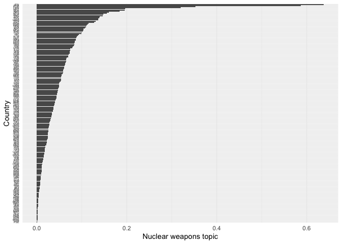
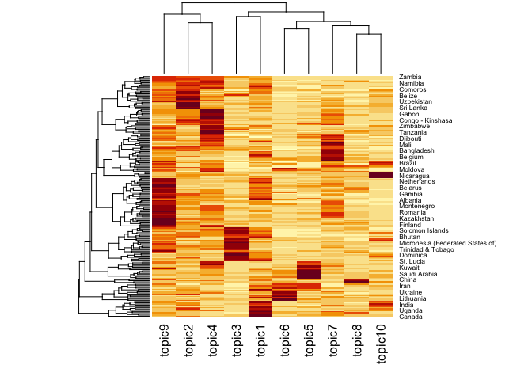
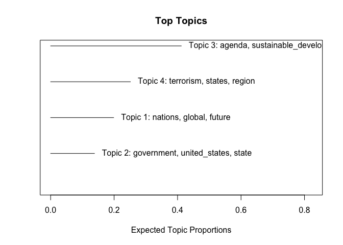
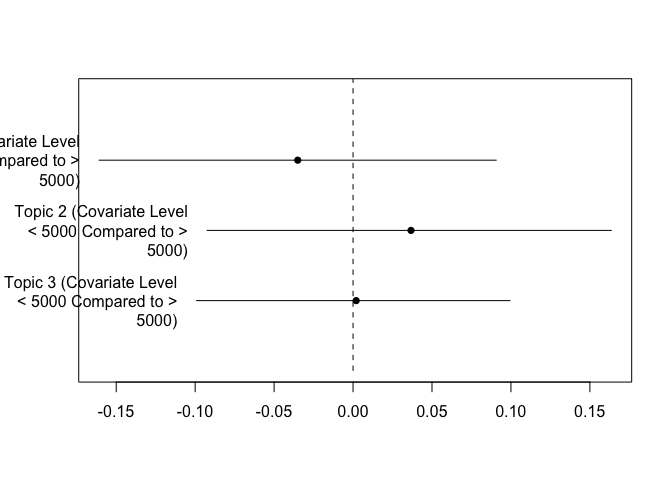

Topic models
================
20 July, 2022

This document gives some examples of how to estimate and visualise LDA
and STM in `R`. For these examples, we will use the corpus
`data_corpus_ungd2017` which contains the speeches from the UN General
Assembly in 2017 and is available in **quanteda.corpora**.

Let’s load necessary libraries first. We will estimate LDA topic models
using the **seededlda** library and structural topic models using the
**stm** library.

``` r
#load libraries
library(quanteda)
library(quanteda.textmodels)
library(quanteda.textplots)
library(quanteda.corpora)
library(quanteda.textstats)
library(seededlda)
library(stm)
library(ggplot2)
library(tidyverse)

corpus_speeches <- data_corpus_ungd2017

summary(corpus_speeches, n = 10)
```

    ## Corpus consisting of 196 documents, showing 10 documents:
    ## 
    ##                  Text Types Tokens Sentences country_iso un_session year
    ##           Afghanistan   781   2059        86         AFG         72 2017
    ##                Angola   681   1938        59         AGO         72 2017
    ##               Albania   838   2277        88         ALB         72 2017
    ##               Andorra   888   2816        90         AND         72 2017
    ##  United Arab Emirates   759   2367        78         ARE         72 2017
    ##             Argentina   834   2450        90         ARG         72 2017
    ##               Armenia   685   1844        78         ARM         72 2017
    ##     Antigua & Barbuda   894   2585       103         ATG         72 2017
    ##             Australia   694   1848        92         AUS         72 2017
    ##               Austria   544   1460        75         AUT         72 2017
    ##               country continent          gdp gdp_per_capita
    ##           Afghanistan      Asia 1.954398e+10            550
    ##                Angola    Africa 1.221238e+11           4100
    ##               Albania    Europe 1.303854e+10           4538
    ##               Andorra    Europe 3.012914e+09          39147
    ##  United Arab Emirates      Asia 3.825751e+11          40699
    ##             Argentina  Americas 6.374303e+11          14398
    ##               Armenia      Asia 1.153659e+10           3937
    ##     Antigua & Barbuda  Americas 1.510085e+09          14803
    ##             Australia   Oceania 1.323421e+12          53800
    ##               Austria    Europe 4.165957e+11          47291

.As you can see the corpus contains 196 speeches, one from each UN
member state. Let’s tokenise this corpus.

``` r
#tokenise the corpus

tokens_speeches <- tokens(corpus_speeches,
                          what = "word",
                          remove_punct = TRUE, 
                          remove_symbols = TRUE, 
                          remove_numbers = TRUE,
                          remove_url = TRUE,
                          remove_separators = TRUE,
                          split_hyphens = FALSE,
                          ) %>%
  tokens_remove(stopwords(source = "smart"), padding = TRUE)
```

Let’s append bigram collocations

``` r
collocations <- tokens_speeches %>%
 # tokens_sample(size = 100, replace = FALSE) %>%
  textstat_collocations(min_count = 10,
                        size = 2:3) %>%
  arrange(-lambda)

head(collocations, 50)
```

    ##                  collocation count count_nested length   lambda         z
    ## 501              addis ababa    21           17      2 17.34648  8.623247
    ## 502            côte d'ivoire    18           12      2 17.19621  8.540587
    ## 503              puerto rico    18           11      2 17.19621  8.540587
    ## 509             burkina faso    13           12      2 16.88114  8.363482
    ## 511               inter alia    12           12      2 16.80418  8.319306
    ## 512         nagorno karabakh    12           10      2 16.80418  8.319306
    ## 487                 viet nam    17           14      2 16.04202  9.720097
    ## 491               boko haram    11            4      2 15.62219  9.414328
    ## 488             saudi arabia    13            4      2 15.27169  9.709138
    ## 481               costa rica    22           16      2 15.19471 10.092488
    ## 426             pope francis    21           16      2 15.14925 12.896612
    ## 489    correspondent banking    11           11      2 15.11136  9.582287
    ## 483              el salvador    15            6      2 15.07337  9.832292
    ## 486               cabo verde    14           10      2 15.00668  9.779538
    ## 479             sierra leone    26           13      2 14.99060 10.126043
    ## 485               san marino    20           13      2 14.35439  9.780416
    ## 158            peter thomson    78           78      2 14.04624 21.757337
    ## 492              ban ki-moon    17           17      2 13.70661  9.410054
    ## 339         antónio guterres    81           81      2 13.16132 15.696790
    ## 497             donald trump    13           13      2 13.07442  8.982682
    ## 496         ethnic cleansing    15            7      2 13.04893  8.999785
    ## 499              saint kitts    12            7      2 12.87229  8.842356
    ## 234          legally binding    20           20      2 12.51970 18.618964
    ## 90           miroslav lajčák    61           61      2 12.47039 26.025428
    ## 388                lake chad    19           17      2 12.30003 14.104419
    ## 505               status quo    17            7      2 12.25012  8.509938
    ## 506       ezulwini consensus    15            3      2 12.20695  8.462409
    ## 508        high commissioner    21           19      2 12.01350  8.377984
    ## 513            arab emirates    16           16      2 11.90543  8.271035
    ## 329       russian federation    13            4      2 11.83767 16.130060
    ## 514          solomon islands    18           10      2 11.77982  8.201531
    ## 405                g-5 sahel    18           15      2 11.58662 13.444654
    ## 211     twenty-first century    32            5      2 11.28101 19.404169
    ## 515    seventy-first session    33            4      2 11.26847  7.903468
    ## 433 greenhouse-gas emissions    10            7      2 11.26845 12.677382
    ## 519           virgin islands    10            9      2 11.14473  7.684123
    ## 69            prime minister    47           29      2 11.12419 28.344376
    ## 432     secretary- general's    13           12      2 11.07285 12.711799
    ## 135                 road map    36           20      2 11.01178 22.851794
    ## 415       two-state solution    38           11      2 10.95786 13.113302
    ## 56     territorial integrity    51           13      2 10.95371 30.237418
    ## 44          korean peninsula    78           14      2 10.86346 33.811300
    ## 440          north-east asia    15            2      2 10.81452 12.543627
    ## 348         non-state actors    14            6      2 10.81044 15.436025
    ## 148   seventy-second session   128           14      2 10.74388 22.205636
    ## 163       ballistic missiles    14            8      2 10.68914 21.630398
    ## 43               middle east    86           28      2 10.66141 33.962015
    ## 521             human beings    41           13      2 10.65159  7.484469
    ## 84            western sahara    33            9      2 10.54062 26.778202
    ## 165         domestic product    27           27      2 10.44962 21.529558

If we want to add the most relevant collocations to our tokens object we
can do so using `tokens_compound`:

``` r
collocations <- collocations %>%
  filter(lambda > 2) %>%
  pull(collocation) %>%
  phrase()

tokens_speeches <- tokens_compound(tokens_speeches, collocations)
```

Let’s include only those tokens that appear in the speeches of at least
5 countries and maximum 150 countries

``` r
dfm_speeches <- dfm(tokens_speeches) %>%
     dfm_trim(min_docfreq = 5, 
             max_docfreq = 150) 

#check the number of documents and features
dim(dfm_speeches)
```

    ## [1]  196 4533

## Estimating an LDA topic model

Let’s estimate two topic models, one with 5 topics and one with 10
topics. This may take a few minutes, depending on your system. *k*
refers to the number of topics to be estimated; this is a parameter
determined by the researcher. The

parameter has an impact on the topic distribution in each document (more
on that in the exercises). In order to make the results reproducible,
we’ll use `set.seed()`. We’ll set the maximum number of iterations at
1000 to speed up estimation (the argument defaults to 2000 iterations).

``` r
set.seed(123)

lda_10 <- textmodel_lda(dfm_speeches, 
                       k = 10,
                       alpha = 1,
                       max_iter = 1000)
```

Take a look at the output of the topic model with 10 topics. For
example, we can take a look at the 10 highest-loading terms for each of
*k* topics.

``` r
terms(lda_10, 10)
```

    ##       topic1           topic2       topic3        topic4                   
    ##  [1,] "future"         "government" "caribbean"   "government"             
    ##  [2,] "nations"        "cent"       "global"      "president"              
    ##  [3,] "responsibility" "national"   "pacific"     "commitment"             
    ##  [4,] "part"           "education"  "call"        "africa"                 
    ##  [5,] "war"            "economy"    "year"        "international_community"
    ##  [6,] "great"          "years"      "action"      "sustainable_development"
    ##  [7,] "build"          "state"      "small"       "end"                    
    ##  [8,] "history"        "dialogue"   "region"      "opportunity"            
    ##  [9,] "live"           "policy"     "sustainable" "implementation"         
    ## [10,] "make"           "women"      "ocean"       "regard"                 
    ##       topic5      topic6       topic7         topic8                        
    ##  [1,] "region"    "state"      "migration"    "nuclear_weapons"             
    ##  [2,] "terrorism" "israel"     "terrorism"    "nuclear"                     
    ##  [3,] "stability" "year"       "fight"        "korea"                       
    ##  [4,] "syria"     "iran"       "human_rights" "north_korea"                 
    ##  [5,] "iraq"      "ukraine"    "organization" "treaty"                      
    ##  [6,] "states"    "occupation" "conflicts"    "security_council"            
    ##  [7,] "state"     "borders"    "regard"       "make"                        
    ##  [8,] "based"     "military"   "call"         "democratic_people's_republic"
    ##  [9,] "crisis"    "palestine"  "states"       "dialogue"                    
    ## [10,] "yemen"     "europe"     "migrants"     "republic"                    
    ##       topic9                    topic10        
    ##  [1,] "agenda"                  "united_states"
    ##  [2,] "global"                  "president"    
    ##  [3,] "sustainable_development" "government"   
    ##  [4,] "cooperation"             "peoples"      
    ##  [5,] "important"               "solidarity"   
    ##  [6,] "human_rights"            "mexico"       
    ##  [7,] "role"                    "america"      
    ##  [8,] "secretary-general"       "sovereignty"  
    ##  [9,] "implementation"          "venezuela"    
    ## [10,] "including"               "social"

*Question*: How would you interpret these topics?

In order to obtain the topic that loads highest on each document, we can
use the `topics` function. We can append this as a variable to our
`docvars`

``` r
head(topics(lda_10), 10)
```

    ##          Afghanistan               Angola              Albania 
    ##               topic1               topic4               topic1 
    ##              Andorra United Arab Emirates            Argentina 
    ##               topic9               topic5               topic2 
    ##              Armenia    Antigua & Barbuda            Australia 
    ##               topic6               topic3               topic9 
    ##              Austria 
    ##               topic7 
    ## 10 Levels: topic1 topic2 topic3 topic4 topic5 topic6 topic7 topic8 ... topic10

``` r
docvars(dfm_speeches, "topic") <- topics(lda_10)

# cross-table of the topic frequency
table(docvars(dfm_speeches, "topic"))
```

    ## 
    ##  topic1  topic2  topic3  topic4  topic5  topic6  topic7  topic8  topic9 topic10 
    ##      21      20      25      32      13       9      16       4      48       8

The topic proportions in each document are stored in an object called
theta
()

``` r
head(lda_10$theta, 10)
```

    ##                          topic1      topic2      topic3      topic4      topic5
    ## Afghanistan          0.27543036 0.142410016 0.051643192 0.023474178 0.109546166
    ## Angola               0.03015873 0.144444444 0.060317460 0.363492063 0.063492063
    ## Albania              0.29004329 0.115440115 0.037518038 0.101010101 0.050505051
    ## Andorra              0.16172840 0.211111111 0.048148148 0.114814815 0.003703704
    ## United Arab Emirates 0.11372064 0.081582200 0.024721879 0.019777503 0.536464771
    ## Argentina            0.10970996 0.350567465 0.034047919 0.105926860 0.046658260
    ## Armenia              0.09506399 0.091407678 0.012797075 0.184643510 0.049360146
    ## Antigua & Barbuda    0.13910761 0.251968504 0.425196850 0.005249344 0.001312336
    ## Australia            0.23462783 0.033980583 0.053398058 0.008090615 0.071197411
    ## Austria              0.10572687 0.004405286 0.004405286 0.013215859 0.094713656
    ##                           topic6      topic7      topic8      topic9
    ## Afghanistan          0.025039124 0.067292645 0.012519562 0.142410016
    ## Angola               0.001587302 0.096825397 0.033333333 0.138095238
    ## Albania              0.116883117 0.089466089 0.033189033 0.157287157
    ## Andorra              0.025925926 0.123456790 0.002469136 0.291358025
    ## United Arab Emirates 0.059332509 0.028430161 0.030902349 0.087762670
    ## Argentina            0.007566204 0.093316520 0.011349306 0.163934426
    ## Armenia              0.327239488 0.089579525 0.003656307 0.106032907
    ## Antigua & Barbuda    0.047244094 0.002624672 0.005249344 0.003937008
    ## Australia            0.042071197 0.050161812 0.184466019 0.310679612
    ## Austria              0.154185022 0.354625551 0.088105727 0.140969163
    ##                          topic10
    ## Afghanistan          0.150234742
    ## Angola               0.068253968
    ## Albania              0.008658009
    ## Andorra              0.017283951
    ## United Arab Emirates 0.017305315
    ## Argentina            0.076923077
    ## Armenia              0.040219378
    ## Antigua & Barbuda    0.118110236
    ## Australia            0.011326861
    ## Austria              0.039647577

Let’s confirm that column sums of

add up to one.

``` r
head(rowSums(lda_10$theta), 10)
```

    ##          Afghanistan               Angola              Albania 
    ##                    1                    1                    1 
    ##              Andorra United Arab Emirates            Argentina 
    ##                    1                    1                    1 
    ##              Armenia    Antigua & Barbuda            Australia 
    ##                    1                    1                    1 
    ##              Austria 
    ##                    1

## Visualizing a LDA topic model

Let’s say we are interested in a nuclear weapons topic. Let’s measure
this topic for each document by summing topic proportions of topics that
contain the word `nuclear_weapons` in the 10 topic LDA model:

``` r
#locate in which topic(s) `nuclear_weapons` appears
nuclear_weapons_topic <- which(terms(lda_10, 10) == 'nuclear_weapons', arr.ind=TRUE)[,2]
print(nuclear_weapons_topic)
```

    ## col 
    ##   8

Now we’ll add up topic proportions of nuclear weapons topics for each
document, and save it as a `docvar` to `speeches_dfm`

``` r
docvars(dfm_speeches, 'nuclear_weapons_topic') <- lda_10$theta[, nuclear_weapons_topic]

#docvars(dfm_speeches, 'nuclear_weapons_topic') <- rowSums(lda_10$theta[, (nuclear_weapons_topic)])
```

Let’s plot the nuclear weapons topic

``` r
data <- docvars(dfm_speeches)

topic_plot <- ggplot(data, aes(y = reorder(country_iso, nuclear_weapons_topic), 
                               x = nuclear_weapons_topic)) + 
  geom_bar(stat = "identity") + theme_minimal() + scale_x_continuous("Nuclear weapons topic") +
  scale_y_discrete("Country") +
  theme(axis.text.y = element_text(size = 4))

print(topic_plot)
```

<!-- -->

*Question*: Do you think this is a good way of summarizing a topic
model? Why yes or why no?

Take a look at topic proportions for each country

``` r
#append the topic proportions

topic_probabilities <- lda_10$theta
rownames(topic_probabilities) <- rownames(dfm_speeches)

heatmap(as.matrix(topic_probabilities[]))
```

<!-- -->

In a heatmap, darker colors correspond with higher proportions, whereas
lighter colors denote lower proportions. In addition, it displays a
clustering of countries and topics? How would you interpret this
heatmap? Do you find this visualization useful?

## Estimating a Structural topic model

Structural topic models allow us to model topical content and topical
prevalence as a function of metadata. We can estimate an stm using the
`stm()` function in the **stm** library. Let’s first estimate an stm
without any metadata and 4 topics

``` r
stm_4 <- stm(dfm_speeches, 
              data = docvars(dfm_speeches),
              seed = 123,
              K = 4,
              verbose = FALSE)
```

We can inspect the estimated topics using `labelTopics`

``` r
labelTopics(stm_4)
```

    ## Topic 1 Top Words:
    ##       Highest Prob: nations, global, future, make, united_states, years, nation 
    ##       FREX: north_korea, canada, lose, korea, india, bahamas, barbuda 
    ##       Lift: lose, prosper, caicos, turks, sanctuary, reckless, enemies 
    ##       Score: lose, barbuda, canada, saint, bahamas, antigua, indigenous_peoples 
    ## Topic 2 Top Words:
    ##       Highest Prob: government, united_states, state, solidarity, israel, states, president 
    ##       FREX: azerbaijan, venezuela, colombia, haiti, israel, georgia, occupation 
    ##       Lift: azerbaijan, guatemala, venezuelans, bolivarian_republic, expressions, reparations, implies 
    ##       Score: azerbaijan, iran, maduro, bolivarian_republic, venezuela, israeli, guatemala 
    ## Topic 3 Top Words:
    ##       Highest Prob: agenda, sustainable_development, global, government, commitment, implementation, human_rights 
    ##       FREX: sustainable_development, implementation, agenda, sids, sdgs, african_union, prevention 
    ##       Lift: adjust, catalytic, complemented, indonesia, kofi, leverage, samoa 
    ##       Score: indonesia, sids, samoa, asean, african_union, pacific_islands_forum, kenya 
    ## Topic 4 Top Words:
    ##       Highest Prob: terrorism, states, region, syria, state, stability, international_community 
    ##       FREX: mali, yemen, ukraine, iraq, libya, extremism, da'esh 
    ##       Lift: hesitate, influx, jungle, losers, libyan, saudi_arabia, admit 
    ##       Score: hesitate, kuwait, arab, libyan, iraqi, mali, niger

We can also plot this model using `plot()`

``` r
plot(stm_4)
```

<!-- -->

`findThoughts()` returns the topic documents associated with a topic

``` r
findThoughts(stm_4,texts = as.character(corpus_speeches), n = 1, topics = c(1))
```

    ## 
    ##  Topic 1: 
    ##       Before I begin, in the light of Tuesday's earthquake in Mexico, I would like to offer Canada's condolences to all families and friends in mourning. We wish a speedy recovery for all those who were injured and thank all first responders for their tireless efforts to help keep people safe. Our thoughts are also with our friends in the Caribbean, who continue to suffer from devastating hurricanes. The generosity and resilience that millions have shown in the face of those natural disasters is an inspiration to the world. Canada stands ready to lend a helping hand whenever we can.
    ## It is an honour to be back here at the General Assembly today and to have an opportunity to speak to this year's theme, namely, "Focusing on people: Striving for peace and a decent life for all on a sustainable planet".
    ## People. Peace. A good quality of life and an environment that we take care of. Equality for all, no matter where. That is what counts in the eyes of Canadians. Throughout our history, we have worked tirelessly to realize our ambitions both at home and elsewhere in the world. Today I would like to speak about the difficult lessons that Canada has learned along the way. Canada is not a wonderland where the difficulties experienced by others do not exist. We face the same challenges. Canada is continually evolving.
    ## Canada remains a work in progress. I want to tell the Assembly about the Canadian experience because, for all the mistakes we have made, we remain hopeful - hopeful that we can do better, and be better, and treat each other with the dignity and the respect that is the birthright of every human being. I want to tell the Assembly our story because I know that the challenges we have faced, and continue to face, are not unique in the world, nor are the solutions. An approach that values human dignity and emphasizes fairness and real opportunity for everyone has a home in Canada and in every country. It is an approach that does not just serve domestic needs but makes the world a better, more peaceful, more prosperous place for all.
    ## This year Canada celebrates the 150th anniversary of out Confederation. But Canada is much older than that. It has been home to the descendants of settlers and immigrants for hundreds of years, and indigenous peoples for millenniums. We are a country that is built on different cultures, different religions and different languages all coming together. Such diversity has become our great strength.
    ## But that is not, and has not always been, true for everyone who shares our land. Canada is built on the ancestral land of indigenous peoples, but, regrettably, it is also a country that came into being without the meaningful participation of those who were there first. Even treaties that were developed to provide a foundation for proper relations have not been fully honoured or implemented. For First Nations, Métis Nation and Inuit peoples in Canada, those early colonial relationships were not about strength through diversity or a celebration of our differences. For indigenous peoples in Canada, their experience was mostly one of humiliation, neglect and abuse.
    ## They were victims of a Government that did not respect them; their traditions, their assets, their way of governing or their laws. It chose to deny and undermine their rights and their dignity. They were victims of a Government that sought to rewrite their unique history and eradicate their languages and cultures by imposing colonial traditions and their own way of life. They were victims of a Government that refused to protect their lands and waters and that rejected their principle of always thinking seven generations ahead.
    ## In short, we rejected the very idea of entire generations of indigenous peoples defining their own lives with the dignity and pride they are due. We have deprived Canada of the significant contributions that those generations could have made to the progression of our great country. The inability of successive Canadian Governments to respect the rights of indigenous peoples in Canada causes us great shame. For too many indigenous peoples, that lack of respect for their rights persists today.
    ## Today there are still children living on reserves in Canada who cannot safely drink, bathe in or even play in the water that comes out of their taps. There are indigenous parents who say goodnight to their children and have to cross their fingers in the hope that their kids will not run away or take their own lives in the night. Young indigenous people in Canada struggle to get a good education. Although residential schools are thankfully a thing of the past, too many indigenous youth are still sent away, far from their families, just to get the basic education most Canadians take for granted. For far too many indigenous women, life in Canada includes threats of violence so frequent and severe that Amnesty International has called it a human rights crisis.
    ## That is the legacy of colonialism in Canada, of a paternalistic Indian Act, of the forced relocation of Inuit and First Nations communities and a systematic denial of Métis rights and history, of residential schools that separated children as young as 5 years old from their families, punished them for speaking their own language and sought to extinguish indigenous cultures entirely.
    ## The good news is that Canadians get it. They see the inequities, and they are fed up with the excuses. And that impatience gives us a rare and precious opportunity to act. We now have before us an opportunity to deliver true, meaningful and lasting reconciliation between Canada and First Nations, the Métis Nation, and Inuit peoples.
    ## At a time where we seek to reconcile, we should be guided by the basic standards adopted in this Hall 10 years ago this month. I know that in the past Canada's position on the United Nations Declaration on the Rights of Indigenous Peoples was disappointing. We actively campaigned and voted against such rights, only to finally accept them reluctantly by saying that it was simply a document of aspirations. However, they are not aspirations. The Declaration is very concrete for indigenous peoples and for those who who worked long and hard to make that document a reality.
    ## In the words of the Truth and Reconciliation Commission of Canada, the Declaration provides the necessary principles, norms and standards for reconciliation to flourish in twenty-first-century Canada. That is not an aspiration, that is a way forward. Last year, at the United Nations Permanent Forum on Indigenous Issues, Canada's then Minister of Indigenous and Northern Affairs finally corrected Canada's position on the Declaration, and announced that we are now, without qualification, a full supporter of the Declaration.
    ## In partnership with indigenous peoples, we are moving ahead with a thorough review of federal laws, policies and operational practices to get our house in order and make sure that our Government is meeting its obligations, including international obligations under the Declaration. We know that the world expects Canada to strictly adhere to international human rights standards - including the United Nations Declaration on the Rights of Indigenous Peoples - and that is what we expect of ourselves too.
    ## We are working closely with indigenous peoples in Canada to better respond to their priorities, to better understand how they see and define self-determination and to support their work of nation rebuilding. Along with indigenous partners, we are co-developing programmes to ensure the preservation, protection and revitalization of Métis, Inuit and First Nations languages. In short, we have been working hard, in partnership with other orders of Government and with indigenous leaders in Canada, to correct past injustices and to bring about a better quality of life for indigenous peoples in Canada.
    ## I will give a few examples. Many will sound familiar because they are closely aligned with the United Nations Sustainable Development Goals (SDGs) - goals that apply to all of our countries without exception. Our efforts include investments to help bring safe and clean drinking water to all indigenous communities, part of Sustainable Development Goal 6, on clean water and sanitation. So far, more than two dozen long-term drinking-water advisories in indigenous communities have been eliminated, and we have a plan to bring to an end those that remain.
    ## Those efforts take the form of new investments to eliminate gaps in the education of First Nations. The new agreements recognize the power and authority of First Nations. They also consider ways to create and manage educational systems that are managed within the communities, by the communities and for the communities. Those important notions are in line with Sustainable Development Goal 4, on quality education.
    ## For many indigenous peoples in Canada, among other things, those investments will enable laying the foundation for reaching Sustainable Development Goal 8, on decent work and economic growth. We know that no one can hope to have a true and equal chance of succeeding without good health, a solid community, a well-paid quality job, quality education and safe and affordable housing. Of course, that also applies to indigenous peoples.
    ## That is why our efforts include working with indigenous communities to help build and refurbish homes. Construction work on nearly 4,000 homes has been completed or is under way, helping to fulfil SDG 11, on making communities safe and sustainable places to live. And across the country, we are also working on a national housing strategy to give more Canadians access to housing that is safe, affordable and adequate.
    ## Our efforts also include a sharper focus on indigenous communities across Canada and around the world as it relates to SDG 5, on combating gender- based violence and giving women and girls equal opportunities to succeed. We need women and girls to succeed because that is how we grow stronger economies and build stronger communities. That is why our Government will be moving forward shortly with legislation to ensure equal pay for work of equal value.
    ## The Sustainable Development Goals are as meaningful in Canada as they are everywhere else in the world. We are committed to implementing them at home, while we also work with our international partners to achieve them around the world. That is important, because poverty and hunger know no borders. We cannot pretend that those solvable challenges happen only on distant shores. The need for greater equality and decent work are real and persistent human needs - ones we cannot afford to ignore, especially in our own countries.
    ## It is up to each of us to ensure that all of us, including indigenous peoples, have better opportunities. It is our responsibility to ensure that true equality is unconditional. Equality applies to us all, regardless of our gender, origin, beliefs or the person we choose to love. It is our responsibility to take better care of the environment that we all share. As I said here at the signing ceremony of the Paris Agreement, we are all implicated, in all senses of the word. We are all responsible, and our new ways of doing things must take that into account.
    ## In Canada that means new relationships between the Government of Canada and indigenous peoples - relationships based on recognition of rights, respect, cooperation and partnership. We recently made changes to our Government structures to help with the transition to those new relationships with indigenous peoples. We are dismantling the old colonial bureaucratic structures and creating a new Department of Crown- Indigenous Relations and Northern Affairs, led by Carolyn Bennett, an experienced and effective advocate for indigenous peoples in Canada. In her new role, she will lead our Government's efforts to better support indigenous peoples as they strengthen their distinct political, cultural, legal and economic institutions and assume autonomy over their own affairs, including the recognition and implementation of self-government as an expression of self-determination.
    ## At the same time, we recognize that in Canada the federal Government has a historic responsibility for providing services to indigenous peoples and an ongoing role to play. To better do that work while at the same time supporting indigenous self-determination, in consultation with indigenous peoples, we will create a new Department of Indigenous Services, led by our former Minister of Health, Jane Philpott. Over time, programmes and services will increasingly be delivered by indigenous peoples, as part of their move towards true self-government and the full implementation of the United Nations Declaration on the Rights of Indigenous Peoples.
    ## We believe that this separation is the best way for Canada to meet its sustainable development commitments, while following the principle of self-determination, which is at the heart of the Declaration. We are in uncharted territory. No one has paved the way for us, but we cannot wait. The time has come to take our own journey together. The time has come to think outside the box, to move away from the limits imposed by old outdated colonial structures and to make room for innovation and structures that respect the inherent rights of indigenous peoples to govern themselves and to determine their own future.
    ## For the federal Government, that means making changes to how we operate. The departmental change I mentioned is part of fulfilling that responsibility. For indigenous peoples, it means taking a hard look at how they define and govern themselves as nations and Governments, and how they seek to relate to other orders of Government. Indigenous peoples will decide how they wish to represent and organize themselves. Some may choose to engage with our Government based on historic nations and treaties, others will use different shared experiences as the basis for coming together. The choice is theirs. That is precisely what self-determination demands.
    ## Although that path is uncharted, I am confident that we will reach a place of reconciliation, that we will reach a place as a country where nation-to- nation, Government-to-Government and Inuit-Crown relationships can be transformed - a place where the standards enshrined in the United Nations Declaration of the Rights of Indigenous Peoples are fully realized not merely by Government mandate, but in true partnership with indigenous peoples.
    ## Part of that new partnership will involve addressing the shared challenge of climate change. Indigenous and northern communities are particularly affected by its stark reality. In communities across the north - places like Paulatuk, Kugluktuk, and Tuktoyaktuk - community members are finding sea ice conditions more dangerous and unpredictable for travelling and hunting in the winter. In Canada's western Arctic, the permafrost is melting and huge pieces of tundra are eroding into the ocean. Around Baffin Island, Inuit elders are finding it difficult to forecast the weather like they used to, so difficult that many are now reluctant to even try.
    ## At home, we are working hard to help those communities adapt and prepare for the future. At the international level, our commitment is unwavering.
    ## There is no country on the planet that can walk away from the challenge and reality of climate change. For our part, Canada will continue to fight for the global plan that has a realistic chance of countering it. We have a responsibility to future generations, and we will uphold it.
    ## We have a chance to build in Canada and around the world economies that are clean, that are growing, that are forward-looking. We will not let that opportunity pass us by.
    ## In Canada that means imposing a tariff on carbon-related pollution. When that is done properly, it is the most effective way of reducing emissions while continuing to grow the economy. It also means continuing to work with other countries to bring us closer to the goals we have set for ourselves. Last week in Montreal, we welcomed environment leaders from over 30 countries to participate in a working meeting. It was an opportunity for us to discuss the various ways of implementing the Paris Agreement and to maintain the international momentum towards a more sustainable future for all.
    ## Likewise, the global community has a responsibility to do all that it can to reduce inequality within and among countries. In Canada we are working hard to achieve that goal. We improved child benefit payments. Our new programme gives nine out of 10 families more money to help with the high cost of raising their kids, and because of that we expect to reduce child poverty in Canada by 40 per cent. We raised taxes on the wealthiest 1 per cent so that we could lower them for the middle class, and we are continuing to look for ways to make our tax system more fair. Right now we have a system that encourages wealthy Canadians to use private corporations to pay a lower tax rate than middle-class Canadians. That is not fair, and we are going to fix it.
    ## We are investing to make education more affordable and accessible so that every Canadian can get the training needed to find and keep a good, well-paying job. That is particularly important at a time when automation is challenging the traditional definition of work.
    ## At the international level, we have reaffirmed Canada's commitment to reducing poverty and injustice, while also putting gender equality and the empowerment of women and girls at the heart of our development efforts. We have adopted that approach because we know that supporting women and girls leads to economic growth, and that peace and cooperation can then take root. Families and communities can then hope for a better quality of life.
    ## We are also working hard to deliver progressive trade agreements such as the Comprehensive Economic and Trade Agreement (CETA) with the European Union, which comes into effect today. CETA will expand opportunities for businesses, create good, well-paying jobs for workers and deliver meaningful economic growth - the kind of growth that benefits all our citizens, not just the wealthiest. We have the opportunity - and I would argue that we have the responsibility - to ensure that trade agreements include strong provisions to safeguard workers' rights, to protect the environment and to ensure that the benefits of trade are felt more broadly. When we do that, we do not just grow our economies, we live up to our values. We say to ourselves and to one another that good enough just is not good enough, and that better is always possible.
    ## It is always possible to do better when people are at the heart of the decisions we make. People, as the theme of this general debate reminds us, are the key to building a peaceful and prosperous future. It is a future that we all want for ourselves, for our children and for our grandchildren. It is a future in which indigenous people in Canada and around the world have the right to participate as equal partners. It is a future that we can build if we work together.
    ## Our efforts to build a better relationship with indigenous peoples in Canada are not only about righting historical wrongs. They are about listening, learning and working together. They are also about concrete actions for the future. The reconciliation that we seek holds lessons for us all.
    ## We cannot build strong relationships if we refuse to have conversations. We cannot chart a more peaceful path if the starting point is suspicion and mistrust. And we cannot build a better world unless we work together, respect our differences, protect the vulnerable and stand up for the things that matter most. As I said last year, I know that it will be hard work. But I remain confident - for Canada's experience shows it to be true - that any challenge can be met if we meet it together.

Let’s now estimate an stm but this time we include metadata. To this end
we will first create a dummy variable that denotes whether a country’s
gdp per capita is smaller than 5000 dollar. We will use `ifelse()` for
this. For some countries we do not have data on GDP. In order for stm
with metadata to work, we’ll remove those from our dfm.

``` r
docvars(dfm_speeches, "gdp_dummy") <- ifelse(docvars(dfm_speeches, "gdp_per_capita") < 5000, 1, 0)

dfm_speeches <- dfm_subset(dfm_speeches, !is.na(gdp_dummy))
```

Let’s investigate if the content of estimated topics is dependent on a
country’s income by estimating an stm with 3 topics and modeling topical
content as a function of our gdp_dummy variable.

``` r
stm_3_metadata <- stm(dfm_speeches, 
                      data = docvars(dfm_speeches),
                      seed = 123,
                      content = ~ gdp_dummy,
                      K = 3,
                      verbose = FALSE)
```

Using `estimateEffect()` we estimate a regression where documents are
the units, the outcome is the proportion of each document about a topic
in an STM model and the covariates are document-meta data. This allows
us to compare topic proportions for both groups of countries (i.e., rich
and poor)

``` r
eff_gdp <- estimateEffect(
  1:3 ~ gdp_dummy, 
  stmobj = stm_3_metadata, 
  meta = docvars(dfm_speeches))
```

Let’s plot these topic proportions

``` r
plot(eff_gdp, "gdp_dummy",
     cov.value1 = "< 5000",
     cov.value2 = "> 5000",
     method = "difference")
```

<!-- -->
We don’t see any noticeable differences here.

## Exercises

Estimate an LDA model with 5 topics on `dfm_speeches` and alpha = 1.
Call the model `lda_5`

Display the 10 highest loading terms for each topic

Show the topic distributions of `lda_5` in the first 20 documents.

Estimate another model with 5 topics, but this time with an alpha
parameter equal to 10. Call it `lda_5_alpha_10`

Show the topic distributions of `lda_5_alpha_10` in the first 20
documents. How do these topic distributions compare to those in `lda_5`.
What do you think the alpha parameter has.

## Optional

Estimate an stm with 5 topics, using the `europe` variable as metadata.
Call it `stm_5_europe`. NB: You can create a binary variable of `europe`
using the `continent` variable in document level metadata and the
`ifelse()` function.

Plot these topics

Using `estimateEffect()` we estimate a regression where documents are
the units, the outcome is the proportion of each document about a topic
in an STM model and the covariate is the europe variable. Call the
output `eff_europe`.

Let’s plot these topic proportions
